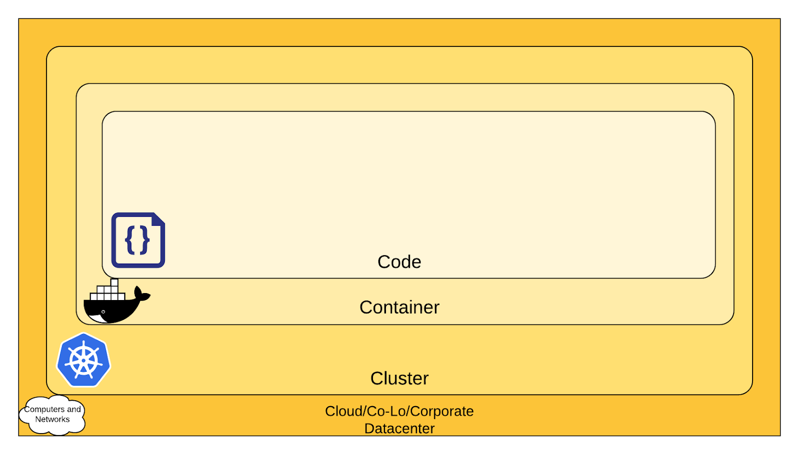
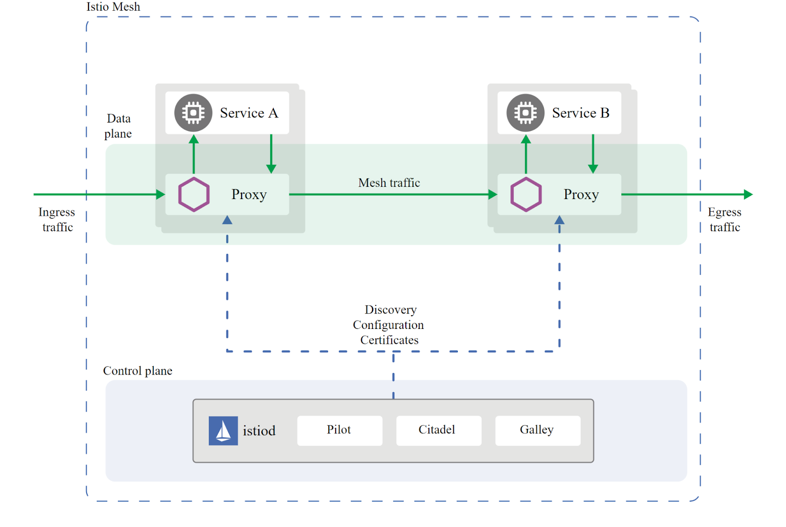
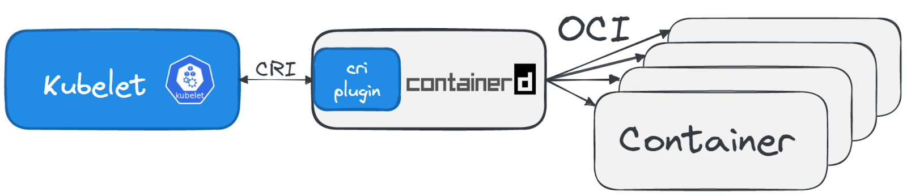
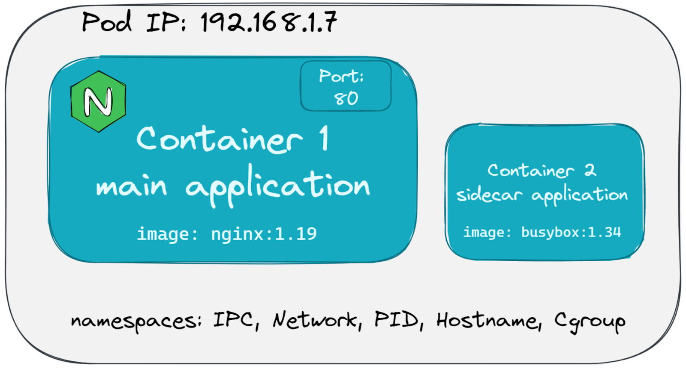

# Main
- [Play with docker](https://labs.play-with-docker.com/)
- [killercoda - środowisko + laby](https://killercoda.com/)
- [Computer Networking Introduction - Ethernet and IP (Heavily Illustrated), by Ivan Velichko (2021)](https://labs.iximiuz.com/courses/computer-networking-fundamentals/from-lan-to-vxlan#lan)

# Chapter 2 - Cloud Native Architecture
## Skalowanie
- vertical scaling - dodawanie ramu, CPU...
- horizontal scaling - nowe instancji aplikacji, np. nowe VM itd. 


## Serverless
- **Serverless** - dostarczamy kod aplikacji, provider robi resztę
Function as a Service (FaaS). The cloud provider abstracts the underlying infrastructure, so that developers can deploy software by uploading their code for example as .zip files or providing a container image.

In contrast to other cloud computing models, serverless computing has an even stronger focus on the on-demand provisioning and scaling of applications.  Autoscaling is an important core concept of serverless and can include scaling and provisioning based on events like incoming requests. This allows for even more precise **billing, which can be based on the events mentioned instead of the widespread time-based billing.**

Instead of fully replacing container orchestration platforms or more traditional virtual machines, FaaS systems are often used in combination or as an extension of existing platforms since they allow for a very fast deployment and make for excellent testing and sandbox environments.

While container images are a great standardized way of packing software for FaaS or serverless systems, systems like **Knative** that are built on top of Kubernetes allow to extend existing platforms with serverless computing abilities. This can be a viable solution for serverless operation in private clouds and on-premises environments. Keep in mind that this can ease the work of a developer, but raise the complexity in operating a cloud platform.

Although there are many advantages to serverless technology, it initially struggled with standardization. Many cloud providers have proprietary offerings that make it difficult to switch between different platforms. To address these problems, the **CloudEvents** project was founded and provides a specification of how event data should be structured. Events are the basis for scaling serverless workloads or triggering corresponding functions. The more vendors and tools adopt such a standard, the easier it becomes to use serverless and event-driven architectures on multiple platforms.

**CloudEvents** is a specification for describing event data in a common way. CloudEvents seeks to dramatically simplify event declaration and delivery across services, platforms, and beyond!

## Open standards
While Docker is often used synonymously with container technologies, the community has committed to the open industry standard of the Open Container Initiative (OCI).

Under the umbrella of the Linux Foundation, the Open Container Initiative provides two standards which define the way how to build and run containers. The image-spec defines how to build and package container images. While the runtime-spec specifies the configuration, execution environment and lifecycle of containers. A more recent addition to the OCI project is the Distribution-Spec, which provides a standard for the distribution of content in general and container images in particular. 

Open standards like this help and complement other systems like Kubernetes, which is the de facto standard platform for orchestrating containers. A few standards that will discover in the following chapters are:
- OCI Spec: image, runtime and distribution specification on how to run, build an distribute containers
- Container Network Interface (CNI): A specification on how to implement networking for Containers.
- Container Runtime Interface (CRI): A specification on how to implement container runtimes in container orchestration systems.
- Container Storage Interface (CSI): A specification on how to implement storage in container orchestration systems.
- Service Mesh Interface (SMI): A specification on how to implement Service Meshes in container orchestration systems with a focus on Kubernetes.

Following this approach, other systems like Prometheus or OpenTelemetry evolved and thrived in this ecosystem and provide additional standards for monitoring and observability.

## Role - stanowiska pracy? 
- DevOps Engineer - Often described as a simple combination of developer and administrator, but that doesn't do the role justice. DevOps engineers use tools and processes that balance out software development and operations. Starting with approaches to writing, building, and testing software throughout the deployment lifecycle.

- Site Reliability Engineer (SRE) - A role with a stronger definition is the Site Reliability Engineer (SRE). SRE was founded around 2003 at Google and became an important job for many organizations. The overarching goal of SRE is to create and maintain software that is reliable and scalable. To achieve this, software engineering approaches are used to solve operational problems and automate operation tasks.

    To measure performance and reliability, SREs use three main metrics:
    - Service Level Objectives (SLO): “Specify a target level for the reliability of your service.” - A goal that is set, for example reaching a service latency of less that 100ms.
    - Service Level Indicators (SLI): “A carefully defined quantitative measure of some aspect of the level of service that is provided” - For example how long a request actually needs to be answered.
    - Service Level Agreements (SLA): “An explicit or implicit contract with your users that includes consequences of meeting (or missing) the SLOs they contain. The consequences are most easily recognized when they are financial – a rebate or a penalty – but they can take other forms.” - Answers the question what happens if SLOs are not met.

    Around these metrics, SREs might define an error budget. An error budget defines the amount (or time) of errors your application can have, before actions are taken, like stopping deployments to production.

# Chapter 3 - Container Orchestration
## Container Basics
Contrary to popular belief, container technologies are much older than one would expect. One of the earliest ancestors of modern container technologies is the chroot command that was introduced in Version 7 Unix in 1979. The chroot command could be used to isolate a process from the root filesystem and basically "hide" the files from the process and simulate a new root directory. The isolated environment is a so-called chroot jail, where the files can’t be accessed by the process, but are still present on the system.


**While chroot is a pretty old technology, it is still in use today by some popular software projects. Container technologies that we have today still embody this very concept, but in a modernized version and with a lot of features on top.**

To isolate a process even more than chroot can do, current Linux kernels provide features like namespaces and cgroups.

Namespaces are used to isolate various resources, for example the network. A network namespace can be used to provide a complete abstraction of network interfaces and routing tables. This allows a process to have its own IP address. The Linux Kernel 5.6 currently provides 8 namespaces:

- pid - process ID provides a process with its own set of process IDs.
- net - network allows the processes to have their own network stack, including the IP address.
- mnt - mount abstracts the filesystem view and manages mount points.
- ipc - inter-process communication provides separation of named shared memory segments.
- user - provides process with their own set of user IDs and group IDs.
- uts - Unix time sharing allows processes to have their own hostname and domain name.
- cgroup - a newer namespace that allows a process to have its own set of cgroup root directories.
- time - the newest namespace can be used to virtualize the clock of the system. 

cgroups are used to organize processes in hierarchical groups and assign them resources like memory and CPU. When you want to limit your application container to let’s say 4GB of memory, cgroups are used under the hood to ensure these limits.


At a first glance, containers seem to be very similar to virtual machines, but it’s crucial to understand that they are very different. While virtual machines emulate a complete machine, including the operating system and a kernel, containers share the kernel of the host machine and, as explained, are only isolated processes.

Virtual machines come with some overhead, be it boot time, size or resource usage to run the operating system. Containers on the other hand are literally processes, like the browser you can start on your machine, therefore they start a lot faster and have a smaller footprint.


**Traditional Deployment vs Virtualized Deployment vs Container Deployment**

In many cases it is not a question of whether you are using containers or virtual machines, rather you are using both technologies to benefit from the efficiency that containers have but still use the security advantages that the greater isolation of virtual machines bring to the table.


# Building Container Images

**Container Images** 


Images can be built by reading the instructions from a buildfile called Dockerfile. The instructions are almost the same as one would use to install an application on a server. Here is an example of a Dockerfile that containerizes a Python script:

```
# Every container image starts with a base image.
# This could be your favorite linux distribution
FROM ubuntu:20.04 

# Run commands to add software and libraries to your image
# Here we install python3 and the pip package manager
RUN apt-get update && \
    apt-get -y install python3 python3-pip 

# The copy command can be used to copy your code to the image
# Here we copy a script called "my-app.py" to the containers filesystem
COPY my-app.py /app/ 

# Defines the workdir in which the application runs
# From this point on everything will be executed in /app
WORKDIR /app

# The process that should be started when the container runs
# In this case we start our python app "my-app.py"
CMD ["python3","my-app.py"]
```

If you have installed Docker on your machine, you can build the image with the following command:

```
docker build -t my-python-image -f Dockerfile
```
With the parameters -t my-python-image you can specify a name tag for your image, and with -f Dockerfile you specify where your Dockerfile can be found. This gives developers the ability to manage all the dependencies of their application and packaging it ready to run instead of leaving that task to another person or team.

To distribute these images, you can use a container registry. This is nothing more than a web server where you can upload and download images. Conveniently, Docker has the push and pull commands built-in:

```
docker push my-registry.com/my-python-image
docker pull my-registry.com/my-python-image
```

# Container Orchestration
## Security
One of the greatest security risks, not only in the container area, is the execution of processes with too many privileges, especially starting processes as root or administrator. Unfortunately, this is a problem that got ignored a lot in the past and there are a lot of containers out there that run as root users. 

A fairly new attack surface that was introduced with containers is the use of public images. Two of the most popular public image registries are Docker Hub and Quay and while it’s great that they provide publicly accessible images, you have to make sure that these images were not modified to include malicious software. 




## Container Orchestration Fundamentals
Container orchestration systems provide a way to build a cluster of multiple servers and host the containers on top. Most container orchestration systems consist of two parts: a *control plane* that is responsible for the management of the containers and *worker nodes* that actually host the containers.

## Networking
Network namespaces allow each container to have its own unique IP address, therefore multiple applications can open the same network port; for example, you could have multiple containerized web servers that all open port 8080.

To make the application accessible from outside the host system, containers have the ability to map a port from the container to a port from the host system. 

Most overlay networks also take care of IP address management, which would be a lot of work if implemented manually. In this case, the overlay network manages which container gets which IP address and how the traffic has to flow to access the individual containers.

Most modern implementations of container networking are based on the [Container Network Interface (CNI)](https://github.com/containernetworking/cni). CNI is a standard that can be used to write or configure network plugins and makes it very easy to swap out different plugins in various container orchestration platforms.


## Service Discovery & DNS
For a long time, server management in traditional data centers was manageable. Many system administrators even remembered all of the IP addresses of important systems they had to work with. Large lists of servers, their host names, IP addresses, and purposes - all maintained manually - were daily business.

In container orchestration platforms things are a lot more complicated. 

The solution to the problem again is automation. Instead of having a manually maintained list of servers (or in this case containers), all the information is put in a *Service Registry*. Finding other services in the network and requesting information about them is called *Service Discovery*.

- DNS - Modern DNS servers that have a service API can be used to register new services as they are created. This approach is pretty straightforward, as most organizations already have DNS servers with the appropriate capabilities.
- Key-Value-Store - Using a strongly consistent datastore especially to store information about services. A lot of systems are able to operate highly available with strong failover mechanisms. Popular choices, especially for clustering, are [etcd](https://github.com/etcd-io/etcd), [Consul](https://www.consul.io/) or [Apache Zookeeper](https://zookeeper.apache.org/).

## Service Mesh
The software you can use to manage network traffic is called a proxy. This is a server application that sits between a client and server and can modify or filter network traffic before it reaches the server. Popular representatives are nginx, haproxy or envoy.

Taking this idea a step further, a service mesh adds a proxy server to every container that you have in your architecture.


**Istio Architecture**, retrieved from [istio.io](https://istio.io/v1.10/docs/ops/deployment/architecture/)

You can now use the proxies to handle network communication between your services.

Let’s take encryption as an example. 

When a service mesh is used, applications don’t talk to each other directly, but the traffic is routed through the proxies instead. The most popular service meshes at the moment are istio and linkerd. While they have differences in implementation, the architecture is the same.

</br>
The proxies in a service mesh form the *data plane*. This is where networking rules are implemented and shape the traffic flow.

These rules are managed centrally in the *control plane* of the service mesh. This is where you define how traffic flows from service A to service B and what configuration should be applied to the proxies.
</br>

So instead of writing code and installing libraries, you just write a config file where you tell the service mesh that service A and service B should always communicate encrypted.

The config is then uploaded to the control plane and distributed to the data plane to enforce the new rule.

For a long time the term "service mesh" only described a basic idea of how traffic in container platforms could be handled with proxies. The Service Mesh Interface (SMI) project aims at defining a specification on how a service mesh from various providers can be implemented.

With a strong focus on Kubernetes, their goal is to standardize the end user experience for service meshes, as well as a standard for the providers that want to integrate with Kubernetes. You can find the current specification on [GitHub](https://github.com/servicemeshinterface/smi-spec).

## Storage
From a storage perspective, containers have a significant flaw: they are ephemeral (ulotne).

Generally speaking, container images are read-only and consist of different layers that include everything that you added during the build phase. That ensures that every time you start a container from an image you get the same behavior and functionality.
To allow writing files, a read-write layer is put on top of the container image when you start a container from an image.


**Container Layers**, retrieved from the [Docker documentation](https://docs.docker.com/engine/storage/drivers/)

The problem here is that this read-write layer is lost when the container is stopped or deleted. Just like the memory of your computer gets erased when you shut it down. To persist data, you need to write it to your disk. 

If a container needs to persist data on a host, a volume can be used to achieve that. The concept and technology for that is quite simple: instead of isolating the whole filesystem of a process, directories that reside on the host are passed through into the container filesystem. If you think that this weakens the isolation of the container, you’re right. When container volumes are used, you effectively give access to the host filesystem.


**Data is shared between two containers on the same host**

When you orchestrate a lot of containers, persisting the data on the host where the container was started might not be the only challenge. Often, data needs to be accessed by multiple containers that are started on different host systems or when a container gets started on a different host it still should have access to its volume.


Container orchestration systems like Kubernetes can help to mitigate these problems, but always require a robust storage system that is attached to the host servers.


**Storage is provisioned via a central storage system. Containers on Server A and Server B can share a volume to read and write data**

In order to keep up with the unbroken growth of various storage implementations, again, the solution was to implement a standard. The [Container Storage Interface (CSI)](https://github.com/container-storage-interface/spec) came up to offer a uniform interface which allows attaching different storage systems no matter if it’s cloud or on-premises storage.

Additional Resources  
Learn more about...
- The History of Containers
    - [A Brief History of Containers: From the 1970s Till Now, by Rani Osnat (2020) It's Here: Docker 1.0, by Julien Barbier (2014)](https://blog.aquasec.com/a-brief-history-of-containers-from-1970s-chroot-to-docker-2016)
- Chroot
    - [chroot](https://wiki.ubuntuusers.de/chroot/)
- Container Performance
    - Container Performance Analysis at DockerCon 2017, by Brendan Gregg
- Best Practices on How to Build Container Images
    - [Top 20 Dockerfile Best Practices, by Álvaro Iradier (2021)](https://sysdig.com/blog/dockerfile-best-practices/)
    - [3 simple tricks for smaller Docker images, by Daniele Polencic (2019)](https://learnk8s.io/blog/smaller-docker-images)
    - [Best practices for building containers](https://cloud.google.com/architecture/application-development)
- Alternatives to Classic Dockerfile Container Building
    - Buildpacks vs Jib vs Dockerfile: Comparing containerization methods, by James Ward (2020)
- Service Discovery
    - Service Discovery in a Microservices Architecture, by Chris Richardson (2015)
- Container Networking
    - Kubernetes Networking Part 1: Networking Essentials, By Simon Kurth (2021)
    - Life of a Packet (I), by Michael Rubin (2017)
    - [Computer Networking Introduction - Ethernet and IP (Heavily Illustrated), by Ivan Velichko (2021)](https://labs.iximiuz.com/courses/computer-networking-fundamentals/from-lan-to-vxlan#lan)
- Container Storage
    - Managing Persistence for Docker Containers, by Janakiram MSV (2016)
- Container and Kubernetes Security
    - Secure containerized environments with updated thread matrix for Kubernetes, by Yossi Weizman (2021)
- Docker Container Playground
    - [Play with Docker](https://labs.play-with-docker.com/)

# Chapter 4 - Kubernetes Fundamentals 
To learn even more Kubernetes basics, you can take the Linux Foundation's free [Introduction to Kubernetes (LFS158x) course on edX.](https://training.linuxfoundation.org/training/introduction-to-kubernetes/)

## Kubernetes Architecture
From a high-level perspective, Kubernetes clusters consist of two different server node types that make up a cluster:
- Control plane node(s)
    These are the brains of the operation. Control plane nodes contain various components which manage the cluster and control various tasks like deployment, scheduling and self-healing of containerized workloads.
- Worker nodes
    The worker nodes are where applications run in your cluster. This is the only job of worker nodes and they don’t have any further logic implemented. Their behavior, like if they should start a container, is completely controlled by the control plane node.


**Kubernetes architecture**
Similar to a microservice architecture you would choose for your own application, Kubernetes incorporates multiple smaller services that need to be installed on the nodes.

### Control plane nodes typically host the following services...  
- **kube-apiserver** - This is the centerpiece of Kubernetes. All other components interact with the api-server and this is where users would access the cluster.
- **etcd** - A database which holds the state of the cluster. [etcd](https://etcd.io/) is a standalone project and not an official part of Kubernetes.
- **kube-scheduler** - When a new workload should be scheduled, the kube-scheduler chooses a worker node that could fit, based on different properties like CPU and memory.
- **kube-controller-manager** - Contains different non-terminating control loops that manage the state of the cluster. For example, one of these control loops can make sure that a desired number of your application is available all the time.
- **cloud-controller-manager (optional)** - Can be used to interact with the API of cloud providers, to create external resources like load balancers, storage or security groups.

### Components of worker nodes  
- **container runtime** - The container runtime is responsible for running the containers on the worker node. For a long time, Docker was the most popular choice, but is now replaced in favor of other runtimes like [containerd](https://containerd.io/).
- **kubelet** - A small agent that runs on every worker node in the cluster. The kubelet talks to the api-server and the container runtime to handle the final stage of starting containers.
- **kube-proxy** - A network proxy that handles inside and outside communication of your cluster. Instead of managing traffic flow on its own, the kube-proxy tries to rely on the networking capabilities of the underlying operating system if possible.
  
**It is important to note that this design makes it possible that applications that are already started on a worker node will continue to run even if the control plane is not available. Although a lot of important functionality like scaling, scheduling new applications, etc., will not be possible while the control plane is offline.**

Kubernetes also has a concept of *namespaces*, which are not to be confused with kernel namespaces that are used to isolate containers. A Kubernetes namespace can be used to divide a cluster into multiple virtual clusters, which can be used for multi-tenancy when multiple teams share a cluster. **Please note that Kubernetes namespaces are not suitable for strong isolation and should more be viewed like a directory on a computer where you can organize objects and manage which user has access to which folder.**


### Kubernetes Setup

Setting up a Kubernetes cluster can be achieved with a lot of different methods. Creating a test "cluster" can be very easy with the right tools:
- Minikube
- kind
- MicroK8s
  
If you want to set up a production-grade cluster on your own hardware or virtual machines, you can choose one of the various installers:
- kubeadm
- kops
- kubespray
  
A few vendors started packaging Kubernetes into a distribution and even offer commercial support:
- Rancher
- k3s
- OpenShift
- VMWare Tanzu

The distributions often choose an opinionated approach and offer additional tools while using Kubernetes as the central piece of their framework.
  
If you don’t want to install and manage it yourself, you can consume it from a cloud provider:
- Amazon (EKS)
- Google (GKE)
- Microsoft (AKS)
- DigitalOcean (DOKS)

#### Interactive Tutorial - Create a Cluster
You can learn how to set up your own Kubernetes cluster with Minikube in this [interactive tutorial.](https://kubernetes.io/docs/tutorials/kubernetes-basics/create-cluster/cluster-intro/)

#### Demo - Kubernetes setup


## Kubernetes API 
The Kubernetes API is the most important component of a Kubernetes cluster. Without it, communication with the cluster is not possible, every user and every component of the cluster itself needs the api-server.


**Access Control Overview**, retrieved from the [Kubernetes documentation](https://kubernetes.io/docs/concepts/security/controlling-access/)

Before a request is processed by Kubernetes, it has to go through three stages:
- **Authentication** - **The requester needs to present a means of identity to authenticate against the API.** Commonly done with a digital signed certificate (X.509) or with an external identity management system. Kubernetes users are always externally managed. Service Accounts can be used to authenticate technical users.
- **Authorization** - **It is decided what the requester is allowed to do.** In Kubernetes this can be done with Role Based Access Control (RBAC).
- **Admission Control** - In the last step, admission controllers can be used to modify or validate the request. For example, if a user tries to use a container image from an untrustworthy registry, an admission controller could block this request. Tools like the Open Policy Agent can be used to manage admission control externally.

Like many other APIs, the Kubernetes API is implemented as a RESTful interface that is exposed over HTTPS. Through the API, a user or service can create, modify, delete or retrieve resources that reside in Kubernetes.

## Running Containers on Kubernetes
How does running a container on your local machine differ from running containers in Kubernetes? In Kubernetes, instead of starting containers directly, you define Pods as the smallest compute unit and Kubernetes translates that into a running container. We will learn more about Pods later, for now imagine it as a wrapper around a container.

When you create a Pod object in Kubernetes, several components are involved in that process, until you get containers running a node.

Here is an example using containerd:

**Running Containers in Kubernetes**

In an effort to allow using other container runtimes than Docker, Kubernetes introduced the Container Runtime Interface (CRI) in 2016.

### Container Runtimes 
- **containerd** is a lightweight and performant implementation to run containers. Arguably the most popular container runtime right now. It is used by all major cloud providers for the Kubernetes As A Service products.
- **CRI-O** was created by Red Hat and with a similar code base closely related to podman and buildah.
- **Docker** - The standard for a long time, but never really made for container orchestration. The usage of Docker as the runtime for Kubernetes has been deprecated and removed in Kubernetes 1.24. Kubernetes has a great blog article that answers all the questions on the matter.
    
The idea of containerd and CRI-O was very simple: provide a runtime that only contains the absolutely essentials to run containers. Nevertheless, they have additional features, like the ability to integrate with container runtime sandboxing tools. These tools try to solve the security problem that comes with sharing the kernel between multiple containers. The most common tools at the moment are:

- **gvisor** - Made by Google, provides an application kernel that sits between the containerized process and the host kernel.
- **Kata Containers** - A secure runtime that provides a lightweight virtual machine, but behaves like a container.

## Networking
Kubernetes networking can be very complicated and hard to understand. A lot of these concepts are not Kubernetes-related and were covered in the Container Orchestration chapter. Again, we have to deal with the problem that a lot of containers need to communicate across a lot of nodes. Kubernetes distinguishes between four different networking problems that need to be solved:

1. **Container-to-Container communications** - This can be solved by the Pod concept as we'll learn later.
2. **Pod-to-Pod communications** - This can be solved with an overlay network.
3. **Pod-to-Service communications** - It is implemented by the kube-proxy and packet filter on the node.
4. **External-to-Service communications** - It is implemented by the kube-proxy and packet filter on the node.
  
There are different ways to implement networking in Kubernetes, but also three important requirements:
- All pods can communicate with each other across nodes.
- All nodes can communicate with all pods.
- No Network Address Translation (NAT).
  
To implement networking, you can choose from a variety of network vendors like:
- Project Calico
- Weave
- Cilium
  
In Kubernetes, every Pod gets its own IP address, so there is no manual configuration involved. Moreover, most Kubernetes setups include a DNS server add-on called core-dns, which can provide service discovery and name resolution inside the cluster.
  
By design, every pod can communicate with other pods on the Kubernetes cluster, however if you want to control the traffic flow at the IP address or port level, then you have to use Network Policies. Network Policies act as cluster internal firewalls. Network Policies can be defined for a set of pods or namespace with the help of a selector to specify what traffic is allowed to and from the pods that match the selector. IP-based Network Policies are defined with IP blocks (CIDR ranges). Network Policies are implemented by the network plugin. To use Network Policies, you must be using a networking solution which supports NetworkPolicy. Creating a NetworkPolicy resource without a controller that implements it will have no effect.

## Scheduling
In its most basic form, scheduling is a sub-category of container orchestration and describes the process of automatically choosing the right (worker) node to run a containerized workload on. In the past, scheduling was more of a manual task where a system administrator would choose the right server for an application by keeping track of the available servers, their capacity and other properties like where they are located.
   
In a Kubernetes cluster, the kube-scheduler is the component that makes the scheduling decision, but is not responsible for actually starting the workload. The scheduling process in Kubernetes always starts when a new Pod object is created. Remember that Kubernetes is using a declarative approach, where the Pod is only described first, then the scheduler selects a node where the Pod actually will get started by the kubelet and the container runtime.
  
A common misconception about Kubernetes is that it has some form of "artificial intelligence" analyzing the workload and moving Pods around based on resource consumption, type of workload and other factors. The truth is that a user has to give information about the application requirements, including requests for CPU and memory and properties of a node. For example, a user could request that their application requires two CPU cores, four gigabytes of memory and should preferably be scheduled on a node with fast disks.
  
The scheduler will use that information to filter all nodes that fit these requirements. If multiple nodes fit the requirements equally, Kubernetes will schedule the Pod on the node with the least amount of Pods. This is also the default behavior if a user has not specified any further requirements.
  
It is possible that the desired state cannot be established, for example, because worker nodes do not have sufficient resources to run your application. In this case, the scheduler will retry to find an appropriate node until the state can be established.

## Additional Resources
Learn more about...
- Kubernetes history and the Borg Heritage
    - From Google to the world: The Kubernetes origin story, by Craig McLuckie (2016)
    - Large-scale cluster management at Google with Borg, by Abhishek Verma, Luis Pedrosa, Madhukar R. Korupolu, David Oppenheimer, Eric Tune, John Wilkes (2015)
- Kubernetes Architecture
    - [Kubernetes Architecture explained | Kubernetes Tutorial 15](https://www.youtube.com/watch?v=umXEmn3cMWY)
- RBAC
    - [Demystifying RBAC in Kubernetes, by Kaitlyn Barnard](https://www.cncf.io/blog/2018/08/01/demystifying-rbac-in-kubernetes/)
- Container Runtime Interface
    - [Introducing Container Runtime Interface (CRI) in Kubernetes (2016)](https://kubernetes.io/blog/2016/12/container-runtime-interface-cri-in-kubernetes/)
- Kubernetes networking and CNI
    - [What is Kubernetes networking?](https://www.vmware.com/topics/glossary/content/kubernetes-networking)
- Internals of Kubernetes Scheduling
    - [A Deep Dive into Kubernetes Scheduling, by Ron Sobol (2020)](https://thenewstack.io/a-deep-dive-into-kubernetes-scheduling/)
- Kubernetes Security Tools
    - Popeye
    - kubeaudit
    - kube-bench
- Kubernetes Playground
    - [Play with Kubernetes](https://labs.play-with-k8s.com/)

# Working with Kubernetes
## Chapter Overview
In this chapter, we will learn about the different Kubernetes objects, their purpose and how to interact with them.

After setting up a cluster or using an already existing one, we can start deploying some workload. The smallest compute unit in Kubernetes is not a container, but a Pod object. That being, a Pod is not the only abstraction we use for workload. Kubernetes has a variety of workload objects that control how Pods are deployed, scaled and managed.

Deploying the workload is not the only task a developer or administrator has to perform. Kubernetes has solutions for some inherent problems with containers and orchestration, be it configuration management, cross-node networking, routing of external traffic, load balancing or scaling of the pods.

## Kubernetes Objects
One of the core concepts of Kubernetes is providing a lot of mostly abstract resources, also called objects, that you can use to describe how your workload should be handled. Some of them are used to handle problems of container orchestration, like scheduling and self-healing, others are there to solve some inherent problems of containers.

Kubernetes objects can be distinguished between workload-oriented objects that are used for handling container workloads and infrastructure-oriented objects, that for example handle configuration, networking and security. Some of these objects can be put into a namespace, while others are available across the whole cluster.

As a user, we can describe these objects in the popular data-serialization language YAML and send them to the api-server, where they get validated before they are created.

*Required fields*
```yaml
apiVersion: apps/v1
kind: Deployment
metadata:
  name: nginx-deployment
spec: 
```
*Required fields*
```yaml
  selector:
    matchLabels:
      app: nginx
  replicas: 2 # tells deployment to run 2 pods matching the template
  template:
    metadata:
      labels:
        app: nginx
    spec:
      containers:
      - name: nginx
        image: nginx:1.19
        ports:
        - containerPort: 80
```

The required fields include:
- **apiVersion**: Each object can be versioned. That means the data structure of the object can change between different versions.
- **kind**: The kind of object that should be created.
- **metadata**: Data that can be used to identify it. A name is required for each object and must be unique. You can use namespaces if you need multiple objects with the same name.
- **spec**: The specification of the object. Here you can describe your desired state. Be cautious, since the structure for the object can change with its version!

Creating, modifying, or deleting an object is only a record of intent where you describe the state your objects should be in. You’re not actively starting pods or even containers for that matter like you would do on your local machine and get direct feedback if it worked or not.

## Interacting with Kubernetes
To access the API, users can use the official command line interface client called kubectl. Let's look at some basic commands for everyday Kubernetes usage.

NOTE: You can learn how to install kubectl in the official documentation.

You can list the available objects in your cluster with the following command:

```shell 
$ kubectl api-resources

NAME                    SHORTNAMES  APIVERSION  NAMESPACED  KIND
...
configmaps              cm          v1          true        ConfigMap
...
namespaces              ns          v1          false       Namespace
nodes                   no          v1          false       Node
persistentvolumeclaims  pvc         v1          true        PersistentVolumeClaim
...
pods                    po          v1          true        Pod
...
services                svc         v1          true        Service
```

Note how objects have short names. That is very helpful for objects with longer names like configmaps or persistentvolumeclaims. The table also shows which objects are namespaced and in what version they're available.

If you want to know more about an object, kubectl has a built-in explanation function!

Let's learn more about pods:

```shell
$ kubectl explain pod

KIND:     Pod
VERSION:  v1

DESCRIPTION:
     Pod is a collection of containers that can run on a host. This resource is     
     created by clients and scheduled onto hosts. 

FIELDS: 
   apiVersion <string>     
     APIVersion defines the versioned schema of this representation of an
     object. Servers should convert recognized schemas to the latest internal         
     value, and may reject unrecognized values.
...
   kind <string>
...
   metadata <Object>
...
   spec <Object>
```

To learn more about the pod spec, you can drill down in the object definition. Use the format: <type>.<fieldName>[.<fieldName>].

```shell
$ kubectl explain pod.spec

KIND:     Pod
VERSION:  v1 

RESOURCE: spec <Object>  

DESCRIPTION:
     Specification of the desired behavior of the pod. More info:

https://git.k8s.io/community/contributors/devel/sig-architecture/api-conventions.md#spec-and-status      

     PodSpec is a description of a pod. 

FIELDS:
   activeDeadlineSeconds <integer>     
     Optional duration in seconds the pod may be active on the node relative to       
     StartTime before the system will actively try to mark it failed and kill         
     associated containers. Value must be a positive integer. 

   affinity <object>     
     If specified, the pod's scheduling constraints 

   automountServiceAccountToken <boolean>     
     AutomountServiceAccountToken indicates whether a service account token           
     should be automatically mounted. 

   containers <[]Object> -required-
...
```
Let's take a look at the basic kubectl commands. You can use the --help flag to view them:

```shell
$ kubectl --help

kubectl controls the Kubernetes cluster manager. 

 Find more information at: https://kubernetes.io/docs/reference/kubectl/overview/ 

Basic Commands (Beginner):
  create Create a resource from a file or from stdin
  expose Take a replication controller, service, deployment or pod and expose it as a new Kubernetes service
  run Run a particular image on the cluster
  set Set specific features on objects 

Basic Commands (Intermediate):
  explain Get documentation for a resource
  get Display one or many resources
  edit Edit a resource on the server
  delete Delete resources by file names, stdin, resources and names, or by resources and label selector
```
To create an object in Kubernetes from a YAML file you can use the following command:

```shell
kubectl create -f <your-file>.yaml
```

There are plenty of graphic user interfaces and dashboards for Kubernetes that allow a visual interaction with the cluster.


**Screenshot of the official Kubernetes Dashboard**

Other tools for interaction with Kubernetes:
- kubernetes/dashboard
- derailed/k9s
- Lens
- VMware Tanzu Octant

Despite the numerous CLI tools and GUIs, there are also advanced tools that allow the creation of templates and the packaging of Kubernetes objects. Probably the most frequently used tool in connection with Kubernetes today is [Helm](https://helm.sh/).

Helm is a package manager for Kubernetes, which allows easier updates and interaction with objects. Helm packages Kubernetes objects in so-called Charts, which can be shared with others via a registry. To get started with Kubernetes, you can search the [ArtifactHub](https://artifacthub.io/) to find your favorite software packages, ready to deploy.

[DEMO - kubectl command](https://drive.google.com/file/d/15YfCK7jRyoZ4uwPkapdZTLvJc5x5Kh6Y/view?usp=drive_link)

## Opis dema - kubectl
```
kubectl config view

controlplane $ kubectl config view
apiVersion: v1
clusters:
- cluster:
    certificate-authority-data: DATA+OMITTED
    server: https://172.30.1.2:6443
  name: kubernetes
contexts:
- context:
    cluster: kubernetes
    user: kubernetes-admin
  name: kubernetes-admin@kubernetes
current-context: kubernetes-admin@kubernetes
kind: Config
preferences: {}
users:
- name: kubernetes-admin
  user:
    client-certificate-data: DATA+OMITTED
    client-key-data: DATA+OMITTED
controlplane $ kubectl config view
apiVersion: v1
clusters:
- cluster:
    certificate-authority-data: DATA+OMITTED
    server: https://172.30.1.2:6443
  name: kubernetes
contexts:
- context:
    cluster: kubernetes
    user: kubernetes-admin
  name: kubernetes-admin@kubernetes
current-context: kubernetes-admin@kubernetes
kind: Config
preferences: {}
users:
- name: kubernetes-admin
  user:
    client-certificate-data: DATA+OMITTED
    client-key-data: DATA+OMITTED
```
## Pod Concept
The most important object in Kubernetes is a Pod. A pod describes a unit of one or more containers that share an isolation layer of namespaces and cgroups. It is the smallest deployable unit in Kubernetes, which also means that Kubernetes is not interacting with containers directly. The pod concept was introduced to allow running a combination of multiple processes that are interdependent. All containers inside a pod share an IP address and can share via the filesystem.


**Multiple containers share namespaces to form a pod**

Here is an example of a simple Pod object with two containers:

```yaml
apiVersion: v1
kind: Pod
metadata:
  name: nginx-with-sidecar
spec:
  containers:
  - name: nginx
    image: nginx:1.19
    ports:
    - containerPort: 80
  - name: count
    image: busybox:1.34
    args: [/bin/sh, -c,
            'i=0; while true; do echo "$i: $(date)"; i=$((i+1)); sleep 1; done']
```

You could add as many containers to your main application as you want. But be careful since you lose the ability to scale them individually! Using a second container that supports your main application is called a **sidecar container**.

All containers defined are started at the same time with no ordering, but you also have the ability to use **initContainers** to start containers before your main application starts. In this example, the init container *init-myservice* tries to reach another service. Once it completes, the main container is started.

```yaml
apiVersion: v1
kind: Pod
metadata:
  name: myapp-pod
  labels:
    app: myapp
spec:
  containers:
  - name: myapp-container
    image: busybox
    command: ['sh', '-c', 'echo The app is running! && sleep 3600']
  # HERE is the initContainer!
  initContainers:
  - name: init-myservice
    image: busybox
    command: ['sh', '-c', 'until nslookup myservice; do echo waiting for myservice; sleep 2; done;']
```

Make sure to explore the documentation about Pods, since there are many more settings to discover. Some examples of important settings that can be set for every container in a Pod are:
- **resources**: Set a resource request and a maximum limit for CPU and Memory. 
- **livenessProbe**: Configure a health check that periodically checks if your application is still alive. Containers can be restarted if the check fails. 
- **securityContext**: Set user & group settings, as well as kernel capabilities.

## Pod Lifecycle
Pods follow a defined lifecycle, starting in the Pending phase, moving through Running if at least one of its primary containers starts OK, and then through either the Succeeded or Failed phases depending on whether any container in the Pod terminated in failure.

### Pod Lifecycle Phases
- Pending - The Pod has been accepted by the Kubernetes cluster, but one or more of the containers has not been set up and made ready to run. This includes time a Pod spends waiting to be scheduled, as well as the time spent downloading container images over the network.
- Running - The Pod has been bound to a node, and all of the containers have been created. At least one container is still running, or is in the process of starting or restarting.
- Succeeded - All containers in the Pod have terminated in success, and will not be restarted.
- Failed - All containers in the Pod have terminated, and at least one container has terminated in failure. That is, the container either exited with non-zero status or was terminated by the system.
- Unknown - For some reason, the state of the Pod could not be obtained. This phase typically occurs due to an error in communicating with the node where the Pod should be running.

## Workload Objects
Working just with Pods would not be flexible enough in a container orchestration platform. For example, if a Pod is lost because a node failed, it is gone forever. To make sure that a defined number of Pod copies runs all the time, we can use controller objects that manage the pod for us.

### Kubernetes Objects
- ReplicaSet - A controller object that ensures a desired number of pods is running at any given time. ReplicaSets can be used to scale out applications and improve their availability. They do this by starting multiple copies of a pod definition.
- Deployment - The most feature-rich object in Kubernetes. A Deployment can be used to describe the complete application lifecycle, they do this by managing multiple ReplicaSets that get updated when the application is changed by providing a new container image, for example. Deployments are perfect to run stateless applications in Kubernetes.
- StatefulSet - Considered a bad practice for a long time, StatefulSets can be used to run stateful applications like databases on Kubernetes. Stateful applications have special requirements that don't fit the ephemeral nature of pods and containers. In contrast to Deployments, StatefulSets try to retain IP addresses of pods and give them a stable name, persistent storage and more graceful handling of scaling and updates.
- DaemonSet - Ensures that a copy of a Pod runs on all (or some) nodes of your cluster. DaemonSets are perfect to run infrastructure-related workload, for example monitoring or logging tools.
- Job - Creates one or more Pods that execute a task and terminate afterwards. Job objects are perfect to run one-shot scripts like database migrations or administrative tasks.
- Cronjob - CronJobs add a time-based configuration to jobs. This allows running Jobs periodically, for example doing a backup job every night at 4am.

Interactive Tutorial - Deploy an App and explore it

You can learn how to deploy an application in your Minikube cluster in the [second part of the interactive tutorial available in the Kubernetes documentation.](https://kubernetes.io/docs/tutorials/kubernetes-basics/deploy-app/deploy-intro/)

Apply what you have learned from "Interacting with Kubernetes" to explore your app in the [third part of the interactive tutorial.](https://kubernetes.io/docs/tutorials/kubernetes-basics/explore/explore-intro/)

### Demo: Workload Objects
[Demo: Workload Objects](https://drive.google.com/file/d/1NH-BjGr5qer0NHjNb5mjbRhfP5I7oSZD/view?usp=drive_link)

## Networking Objects
Since a lot of Pods would require a lot of manual network configuration, we can use Service and Ingress objects to define and abstract networking.

Services can be used to expose a set of pods as a network service. 


### Service Types
- ClusterIP - The most common service type. A ClusterIP is a virtual IP inside Kubernetes that can be used as a single endpoint for a set of pods. This service type can be used as a round-robin load balancer.

<p align="center">
  
</p>
- NodePort - The NodePort service type extends the ClusterIP by adding simple routing rules. It opens a port (default between 30000-32767) on every node in the cluster and maps it to the ClusterIP. This service type allows routing external traffic to the cluster.
- LoadBalancer - The LoadBalancer service type extends the NodePort by deploying an external LoadBalancer instance. This will only work if you’re in an environment that has an API to configure a LoadBalancer instance, like GCP, AWS, Azure or even OpenStack.
- ExternalName - A special service type that has no routing whatsoever. ExternalName is using the Kubernetes internal DNS server to create a DNS alias. You can use this to create a simple alias to resolve a rather complicated hostname like: my-cool-database-az1-uid123.cloud-provider-i-like.com. This is especially useful if you want to reach external resources from your Kubernetes cluster.
- Headless Services - Sometimes you don't need load-balancing and a single Service IP. In this case, you can create what are termed "headless" Services, by explicitly specifying "None" for the cluster IP (.spec.clusterIP).

You can use a headless Service to interface with other service discovery mechanisms, without being tied to Kubernetes' implementation.

For headless Services, a cluster IP is not allocated, kube-proxy does not handle these Services, and there is no load balancing or proxying done by the platform for them. How DNS is automatically configured depends on whether the Service has selectors defined with or without selectors.

Example: A StatefulSet controller can use the Headless Service to control the domain of its pods, where stable network id is the need and not load-balancing.

<p align="center">
  
</p>

**ClusterIP, NodePort and LoadBalancer extend each other**

If you need even more flexibility to expose applications, you can use an *Ingress object*. Ingress provides a means to expose HTTP and HTTPS routes from outside of the cluster for a service within the cluster. It does this by configuring routing rules that a user can set and implement with an *ingress controller*.

<p align="center">
  
</p>

**Example of where an Ingress sends all its traffic to one Service**, retrieved from the [Kubernetes documentation](https://kubernetes.io/docs/concepts/services-networking/ingress/)

Standard features of ingress controllers may include:
- LoadBalancing
- TLS offloading/termination
- Name-based virtual hosting
- Path-based routing

A lot of ingress controllers even provide more features, like:
- Redirects
- Custom errors
- Authentication
- Session affinity
- Monitoring
- Logging
- Weighted routing
- Rate limiting.

Kubernetes also provides a cluster internal firewall with the NetworkPolicy concept. NetworkPolicies are a simple IP firewall (OSI Layer 3 or 4) that can control traffic based on rules. You can define rules for incoming (ingress) and outgoing traffic (egress). A typical use case for NetworkPolicies would be restricting the traffic between two different namespaces.

### Interactive Tutorial - Expose Your App
You can now learn how to [expose your application with a Service](https://kubernetes.io/docs/tutorials/kubernetes-basics/expose/expose-intro/) in the fourth part of the interactive tutorial available in the Kubernetes documentation.

## Demo - Using Services
[DEMO - Using Services](https://drive.google.com/file/d/191pmFUytUkJ0pZWGOU0cAo8acRzhc_mV/view?usp=drive_link)

## Volume & Storage Objects
As mentioned earlier, containers were not designed with persistent storage in mind, especially when that storage spans across multiple nodes. Kubernetes introduces a few solutions, but note that these solutions do not automatically remove all of the complexities of managing storage with containers.

Containers already had the concept of mounting volumes, but since we’re not working with containers directly, Kubernetes made volumes part of a Pod, just like containers are.

Here’s an example of a hostPath volume mount that is similar to a host mount introduced by Docker:

```yaml
apiVersion: v1
kind: Pod
metadata:
  name: test-pd
spec:
  containers:
  - image: k8s.gcr.io/test-webserver
    name: test-container
    volumeMounts:
    - mountPath: /test-pd
      name: test-volume
  volumes:
  - name: test-volume
    hostPath:
      # directory location on host
      path: /data
      # this field is optional
      type: Directory
```


```hostPath``` **Volume Mount**

Volumes allow sharing data between multiple pods in the cluster and also between multiple containers within the same Pod. This concept allows for great flexibility when you want to use a sidecar pattern. The second purpose they serve is preventing data loss when a Pod crashes and is restarted on the same node. Pods are started in a clean state, but all data is lost unless written to a volume.

Unfortunately, a cluster environment with multiple servers requires even more flexibility when it comes to persistent storage. Depending on the environment, we can use cloud block storage like Amazon EBS, Google Persistent Disks, Azure Disk Storage or consume from storage systems like Ceph, GlusterFS or more traditional systems like NFS.

These are only a few examples of storage that can be used in Kubernetes. To make the user experience more uniform, Kubernetes is using the Container Storage Interface (CSI) which allows the storage vendor to write a plugin (storage driver) that can be used in Kubernetes.

To use this abstraction, we have two more objects that can be used:
- PersistentVolumes (PV)
An abstract description for a slice of storage. The object configuration holds information like type of volume, volume size, access mode and unique identifiers and information how to mount it.
- PersistentVolumeClaims (PVC)
A request for storage by a user. If the cluster has multiple persistent volumes, the user can create a PVC which will reserve a persistent volume according to the user's needs. 

```yaml
apiVersion: v1
kind: PersistentVolume
metadata:
  name: test-pv
spec:
  capacity:
    storage: 50Gi
  volumeMode: Filesystem
  accessModes:
    - ReadWriteOnce
  csi:
    driver: ebs.csi.aws.com
    volumeHandle: vol-05786ec9ec9526b67
---
apiVersion: v1
kind: PersistentVolumeClaim
metadata:
  name: ebs-claim
spec:
  accessModes:
    - ReadWriteOnce
  resources:
    requests:
      storage: 50Gi
---
apiVersion: v1
kind: Pod
metadata:
  name: app
spec:
  containers:
    - name: app
      image: centos
      command: ["/bin/sh"]
      args:
        ["-c", "while true; do echo $(date -u) >> /data/out.txt; sleep 5; done"]
      volumeMounts:
        - name: persistent-storage
          mountPath: /data
  volumes:
    - name: persistent-storage
      persistentVolumeClaim:
        claimName: ebs-claim
```

The example shows a PersistentVolume that uses an AWS EBS volume implemented with a CSI driver. After the PersistentVolume is provisioned, a developer can reserve it with a PersistentVolumeClaim. The last step is using the PVC as a volume in a Pod, just like the hostPath example we saw before.

It is possible to operate storage clusters directly in Kubernetes. Projects like Rook provide cloud-native storage orchestration and integrate with battle tested storage solutions like Ceph.


**Rook Architecture**, retrieved from the Rook documentation