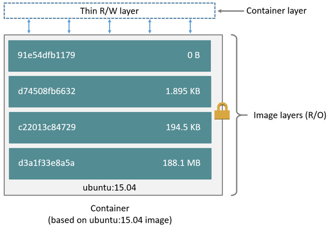
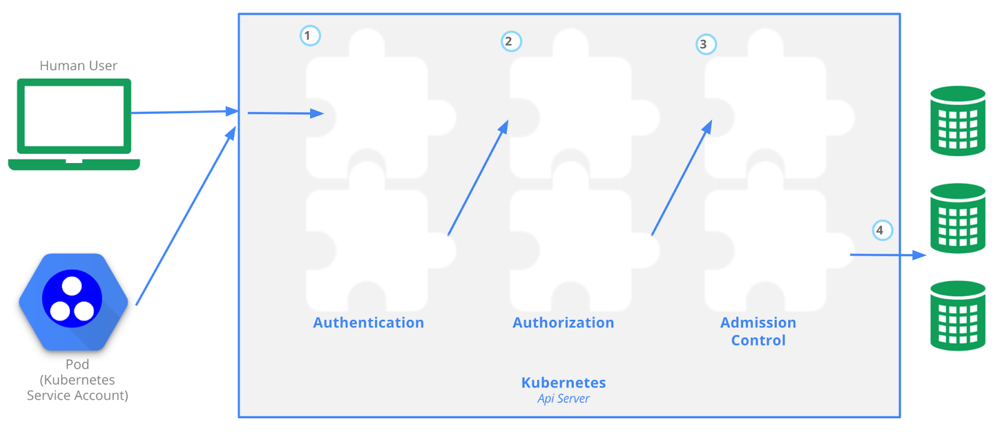
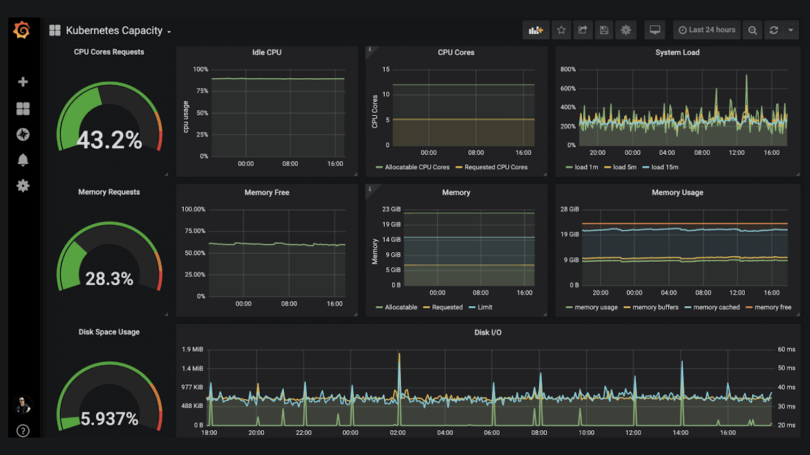

# Main
- [Play with docker](https://labs.play-with-docker.com/)
- [killercoda - środowisko + laby](https://killercoda.com/)
- [Computer Networking Introduction - Ethernet and IP (Heavily Illustrated), by Ivan Velichko (2021)](https://labs.iximiuz.com/courses/computer-networking-fundamentals/from-lan-to-vxlan#lan)

# Chapter 2 - Cloud Native Architecture
## Skalowanie
- vertical scaling - dodawanie ramu, CPU...
- horizontal scaling - nowe instancji aplikacji, np. nowe VM itd. 


## Serverless
- **Serverless** - dostarczamy kod aplikacji, provider robi resztę
Function as a Service (FaaS). The cloud provider abstracts the underlying infrastructure, so that developers can deploy software by uploading their code for example as .zip files or providing a container image.

In contrast to other cloud computing models, serverless computing has an even stronger focus on the on-demand provisioning and scaling of applications.  Autoscaling is an important core concept of serverless and can include scaling and provisioning based on events like incoming requests. This allows for even more precise **billing, which can be based on the events mentioned instead of the widespread time-based billing.**

Instead of fully replacing container orchestration platforms or more traditional virtual machines, FaaS systems are often used in combination or as an extension of existing platforms since they allow for a very fast deployment and make for excellent testing and sandbox environments.

While container images are a great standardized way of packing software for FaaS or serverless systems, systems like **Knative** that are built on top of Kubernetes allow to extend existing platforms with serverless computing abilities. This can be a viable solution for serverless operation in private clouds and on-premises environments. Keep in mind that this can ease the work of a developer, but raise the complexity in operating a cloud platform.

Although there are many advantages to serverless technology, it initially struggled with standardization. Many cloud providers have proprietary offerings that make it difficult to switch between different platforms. To address these problems, the **CloudEvents** project was founded and provides a specification of how event data should be structured. Events are the basis for scaling serverless workloads or triggering corresponding functions. The more vendors and tools adopt such a standard, the easier it becomes to use serverless and event-driven architectures on multiple platforms.

**CloudEvents** is a specification for describing event data in a common way. CloudEvents seeks to dramatically simplify event declaration and delivery across services, platforms, and beyond!

## Open standards
While Docker is often used synonymously with container technologies, the community has committed to the open industry standard of the Open Container Initiative (OCI).

Under the umbrella of the Linux Foundation, the Open Container Initiative provides two standards which define the way how to build and run containers. The image-spec defines how to build and package container images. While the runtime-spec specifies the configuration, execution environment and lifecycle of containers. A more recent addition to the OCI project is the Distribution-Spec, which provides a standard for the distribution of content in general and container images in particular. 

Open standards like this help and complement other systems like Kubernetes, which is the de facto standard platform for orchestrating containers. A few standards that will discover in the following chapters are:
- OCI Spec: image, runtime and distribution specification on how to run, build an distribute containers
- Container Network Interface (CNI): A specification on how to implement networking for Containers.
- Container Runtime Interface (CRI): A specification on how to implement container runtimes in container orchestration systems.
- Container Storage Interface (CSI): A specification on how to implement storage in container orchestration systems.
- Service Mesh Interface (SMI): A specification on how to implement Service Meshes in container orchestration systems with a focus on Kubernetes.

Following this approach, other systems like Prometheus or OpenTelemetry evolved and thrived in this ecosystem and provide additional standards for monitoring and observability.

## Role - stanowiska pracy? 
- DevOps Engineer - Often described as a simple combination of developer and administrator, but that doesn't do the role justice. DevOps engineers use tools and processes that balance out software development and operations. Starting with approaches to writing, building, and testing software throughout the deployment lifecycle.

- Site Reliability Engineer (SRE) - A role with a stronger definition is the Site Reliability Engineer (SRE). SRE was founded around 2003 at Google and became an important job for many organizations. The overarching goal of SRE is to create and maintain software that is reliable and scalable. To achieve this, software engineering approaches are used to solve operational problems and automate operation tasks.

    To measure performance and reliability, SREs use three main metrics:
    - Service Level Objectives (SLO): “Specify a target level for the reliability of your service.” - A goal that is set, for example reaching a service latency of less that 100ms.
    - Service Level Indicators (SLI): “A carefully defined quantitative measure of some aspect of the level of service that is provided” - For example how long a request actually needs to be answered.
    - Service Level Agreements (SLA): “An explicit or implicit contract with your users that includes consequences of meeting (or missing) the SLOs they contain. The consequences are most easily recognized when they are financial – a rebate or a penalty – but they can take other forms.” - Answers the question what happens if SLOs are not met.

    Around these metrics, SREs might define an error budget. An error budget defines the amount (or time) of errors your application can have, before actions are taken, like stopping deployments to production.

# Chapter 3 - Container Orchestration
## Container Basics
Contrary to popular belief, container technologies are much older than one would expect. One of the earliest ancestors of modern container technologies is the chroot command that was introduced in Version 7 Unix in 1979. The chroot command could be used to isolate a process from the root filesystem and basically "hide" the files from the process and simulate a new root directory. The isolated environment is a so-called chroot jail, where the files can’t be accessed by the process, but are still present on the system.


**While chroot is a pretty old technology, it is still in use today by some popular software projects. Container technologies that we have today still embody this very concept, but in a modernized version and with a lot of features on top.**

To isolate a process even more than chroot can do, current Linux kernels provide features like namespaces and cgroups.

Namespaces are used to isolate various resources, for example the network. A network namespace can be used to provide a complete abstraction of network interfaces and routing tables. This allows a process to have its own IP address. The Linux Kernel 5.6 currently provides 8 namespaces:

- pid - process ID provides a process with its own set of process IDs.
- net - network allows the processes to have their own network stack, including the IP address.
- mnt - mount abstracts the filesystem view and manages mount points.
- ipc - inter-process communication provides separation of named shared memory segments.
- user - provides process with their own set of user IDs and group IDs.
- uts - Unix time sharing allows processes to have their own hostname and domain name.
- cgroup - a newer namespace that allows a process to have its own set of cgroup root directories.
- time - the newest namespace can be used to virtualize the clock of the system. 

cgroups are used to organize processes in hierarchical groups and assign them resources like memory and CPU. When you want to limit your application container to let’s say 4GB of memory, cgroups are used under the hood to ensure these limits.


At a first glance, containers seem to be very similar to virtual machines, but it’s crucial to understand that they are very different. While virtual machines emulate a complete machine, including the operating system and a kernel, containers share the kernel of the host machine and, as explained, are only isolated processes.

Virtual machines come with some overhead, be it boot time, size or resource usage to run the operating system. Containers on the other hand are literally processes, like the browser you can start on your machine, therefore they start a lot faster and have a smaller footprint.


**Traditional Deployment vs Virtualized Deployment vs Container Deployment**

In many cases it is not a question of whether you are using containers or virtual machines, rather you are using both technologies to benefit from the efficiency that containers have but still use the security advantages that the greater isolation of virtual machines bring to the table.


# Building Container Images

**Container Images** 


Images can be built by reading the instructions from a buildfile called Dockerfile. The instructions are almost the same as one would use to install an application on a server. Here is an example of a Dockerfile that containerizes a Python script:

```
# Every container image starts with a base image.
# This could be your favorite linux distribution
FROM ubuntu:20.04 

# Run commands to add software and libraries to your image
# Here we install python3 and the pip package manager
RUN apt-get update && \
    apt-get -y install python3 python3-pip 

# The copy command can be used to copy your code to the image
# Here we copy a script called "my-app.py" to the containers filesystem
COPY my-app.py /app/ 

# Defines the workdir in which the application runs
# From this point on everything will be executed in /app
WORKDIR /app

# The process that should be started when the container runs
# In this case we start our python app "my-app.py"
CMD ["python3","my-app.py"]
```

If you have installed Docker on your machine, you can build the image with the following command:

```
docker build -t my-python-image -f Dockerfile
```
With the parameters -t my-python-image you can specify a name tag for your image, and with -f Dockerfile you specify where your Dockerfile can be found. This gives developers the ability to manage all the dependencies of their application and packaging it ready to run instead of leaving that task to another person or team.

To distribute these images, you can use a container registry. This is nothing more than a web server where you can upload and download images. Conveniently, Docker has the push and pull commands built-in:

```
docker push my-registry.com/my-python-image
docker pull my-registry.com/my-python-image
```

# Container Orchestration
## Security
One of the greatest security risks, not only in the container area, is the execution of processes with too many privileges, especially starting processes as root or administrator. Unfortunately, this is a problem that got ignored a lot in the past and there are a lot of containers out there that run as root users. 

A fairly new attack surface that was introduced with containers is the use of public images. Two of the most popular public image registries are Docker Hub and Quay and while it’s great that they provide publicly accessible images, you have to make sure that these images were not modified to include malicious software. 


## Container Orchestration Fundamentals
Container orchestration systems provide a way to build a cluster of multiple servers and host the containers on top. Most container orchestration systems consist of two parts: a *control plane* that is responsible for the management of the containers and *worker nodes* that actually host the containers.

## Networking
Network namespaces allow each container to have its own unique IP address, therefore multiple applications can open the same network port; for example, you could have multiple containerized web servers that all open port 8080.

To make the application accessible from outside the host system, containers have the ability to map a port from the container to a port from the host system. 

Most overlay networks also take care of IP address management, which would be a lot of work if implemented manually. In this case, the overlay network manages which container gets which IP address and how the traffic has to flow to access the individual containers.

Most modern implementations of container networking are based on the [Container Network Interface (CNI)](https://github.com/containernetworking/cni). CNI is a standard that can be used to write or configure network plugins and makes it very easy to swap out different plugins in various container orchestration platforms.


## Service Discovery & DNS
For a long time, server management in traditional data centers was manageable. Many system administrators even remembered all of the IP addresses of important systems they had to work with. Large lists of servers, their host names, IP addresses, and purposes - all maintained manually - were daily business.

In container orchestration platforms things are a lot more complicated. 

The solution to the problem again is automation. Instead of having a manually maintained list of servers (or in this case containers), all the information is put in a *Service Registry*. Finding other services in the network and requesting information about them is called *Service Discovery*.

- DNS - Modern DNS servers that have a service API can be used to register new services as they are created. This approach is pretty straightforward, as most organizations already have DNS servers with the appropriate capabilities.
- Key-Value-Store - Using a strongly consistent datastore especially to store information about services. A lot of systems are able to operate highly available with strong failover mechanisms. Popular choices, especially for clustering, are [etcd](https://github.com/etcd-io/etcd), [Consul](https://www.consul.io/) or [Apache Zookeeper](https://zookeeper.apache.org/).

## Service Mesh
The software you can use to manage network traffic is called a proxy. This is a server application that sits between a client and server and can modify or filter network traffic before it reaches the server. Popular representatives are nginx, haproxy or envoy.

Taking this idea a step further, a service mesh adds a proxy server to every container that you have in your architecture.


**Istio Architecture**, retrieved from [istio.io](https://istio.io/v1.10/docs/ops/deployment/architecture/)

You can now use the proxies to handle network communication between your services.

Let’s take encryption as an example. 

When a service mesh is used, applications don’t talk to each other directly, but the traffic is routed through the proxies instead. The most popular service meshes at the moment are istio and linkerd. While they have differences in implementation, the architecture is the same.

</br>
The proxies in a service mesh form the *data plane*. This is where networking rules are implemented and shape the traffic flow.

These rules are managed centrally in the *control plane* of the service mesh. This is where you define how traffic flows from service A to service B and what configuration should be applied to the proxies.
</br>

So instead of writing code and installing libraries, you just write a config file where you tell the service mesh that service A and service B should always communicate encrypted.

The config is then uploaded to the control plane and distributed to the data plane to enforce the new rule.

For a long time the term "service mesh" only described a basic idea of how traffic in container platforms could be handled with proxies. The Service Mesh Interface (SMI) project aims at defining a specification on how a service mesh from various providers can be implemented.

With a strong focus on Kubernetes, their goal is to standardize the end user experience for service meshes, as well as a standard for the providers that want to integrate with Kubernetes. You can find the current specification on [GitHub](https://github.com/servicemeshinterface/smi-spec).

## Storage
From a storage perspective, containers have a significant flaw: they are ephemeral (ulotne).

Generally speaking, container images are read-only and consist of different layers that include everything that you added during the build phase. That ensures that every time you start a container from an image you get the same behavior and functionality.
To allow writing files, a read-write layer is put on top of the container image when you start a container from an image.


**Container Layers**, retrieved from the [Docker documentation](https://docs.docker.com/engine/storage/drivers/)

The problem here is that this read-write layer is lost when the container is stopped or deleted. Just like the memory of your computer gets erased when you shut it down. To persist data, you need to write it to your disk. 

If a container needs to persist data on a host, a volume can be used to achieve that. The concept and technology for that is quite simple: instead of isolating the whole filesystem of a process, directories that reside on the host are passed through into the container filesystem. If you think that this weakens the isolation of the container, you’re right. When container volumes are used, you effectively give access to the host filesystem.


**Data is shared between two containers on the same host**

When you orchestrate a lot of containers, persisting the data on the host where the container was started might not be the only challenge. Often, data needs to be accessed by multiple containers that are started on different host systems or when a container gets started on a different host it still should have access to its volume.


Container orchestration systems like Kubernetes can help to mitigate these problems, but always require a robust storage system that is attached to the host servers.


**Storage is provisioned via a central storage system. Containers on Server A and Server B can share a volume to read and write data**

In order to keep up with the unbroken growth of various storage implementations, again, the solution was to implement a standard. The [Container Storage Interface (CSI)](https://github.com/container-storage-interface/spec) came up to offer a uniform interface which allows attaching different storage systems no matter if it’s cloud or on-premises storage.

Additional Resources  
Learn more about...
- The History of Containers
    - [A Brief History of Containers: From the 1970s Till Now, by Rani Osnat (2020) It's Here: Docker 1.0, by Julien Barbier (2014)](https://blog.aquasec.com/a-brief-history-of-containers-from-1970s-chroot-to-docker-2016)
- Chroot
    - [chroot](https://wiki.ubuntuusers.de/chroot/)
- Container Performance
    - Container Performance Analysis at DockerCon 2017, by Brendan Gregg
- Best Practices on How to Build Container Images
    - [Top 20 Dockerfile Best Practices, by Álvaro Iradier (2021)](https://sysdig.com/blog/dockerfile-best-practices/)
    - [3 simple tricks for smaller Docker images, by Daniele Polencic (2019)](https://learnk8s.io/blog/smaller-docker-images)
    - [Best practices for building containers](https://cloud.google.com/architecture/application-development)
- Alternatives to Classic Dockerfile Container Building
    - Buildpacks vs Jib vs Dockerfile: Comparing containerization methods, by James Ward (2020)
- Service Discovery
    - Service Discovery in a Microservices Architecture, by Chris Richardson (2015)
- Container Networking
    - Kubernetes Networking Part 1: Networking Essentials, By Simon Kurth (2021)
    - Life of a Packet (I), by Michael Rubin (2017)
    - [Computer Networking Introduction - Ethernet and IP (Heavily Illustrated), by Ivan Velichko (2021)](https://labs.iximiuz.com/courses/computer-networking-fundamentals/from-lan-to-vxlan#lan)
- Container Storage
    - Managing Persistence for Docker Containers, by Janakiram MSV (2016)
- Container and Kubernetes Security
    - Secure containerized environments with updated thread matrix for Kubernetes, by Yossi Weizman (2021)
- Docker Container Playground
    - [Play with Docker](https://labs.play-with-docker.com/)

# Chapter 4 - Kubernetes Fundamentals 
To learn even more Kubernetes basics, you can take the Linux Foundation's free [Introduction to Kubernetes (LFS158x) course on edX.](https://training.linuxfoundation.org/training/introduction-to-kubernetes/)

## Kubernetes Architecture
From a high-level perspective, Kubernetes clusters consist of two different server node types that make up a cluster:
- Control plane node(s)
    These are the brains of the operation. Control plane nodes contain various components which manage the cluster and control various tasks like deployment, scheduling and self-healing of containerized workloads.
- Worker nodes
    The worker nodes are where applications run in your cluster. This is the only job of worker nodes and they don’t have any further logic implemented. Their behavior, like if they should start a container, is completely controlled by the control plane node.


**Kubernetes architecture**
Similar to a microservice architecture you would choose for your own application, Kubernetes incorporates multiple smaller services that need to be installed on the nodes.

### Control plane nodes typically host the following services...  
- **kube-apiserver** - This is the centerpiece of Kubernetes. All other components interact with the api-server and this is where users would access the cluster.
- **etcd** - A database which holds the state of the cluster. [etcd](https://etcd.io/) is a standalone project and not an official part of Kubernetes.
- **kube-scheduler** - When a new workload should be scheduled, the kube-scheduler chooses a worker node that could fit, based on different properties like CPU and memory.
- **kube-controller-manager** - Contains different non-terminating control loops that manage the state of the cluster. For example, one of these control loops can make sure that a desired number of your application is available all the time.
- **cloud-controller-manager (optional)** - Can be used to interact with the API of cloud providers, to create external resources like load balancers, storage or security groups.

### Components of worker nodes  
- **container runtime** - The container runtime is responsible for running the containers on the worker node. For a long time, Docker was the most popular choice, but is now replaced in favor of other runtimes like [containerd](https://containerd.io/).
- **kubelet** - A small agent that runs on every worker node in the cluster. The kubelet talks to the api-server and the container runtime to handle the final stage of starting containers.
- **kube-proxy** - A network proxy that handles inside and outside communication of your cluster. Instead of managing traffic flow on its own, the kube-proxy tries to rely on the networking capabilities of the underlying operating system if possible.
  
**It is important to note that this design makes it possible that applications that are already started on a worker node will continue to run even if the control plane is not available. Although a lot of important functionality like scaling, scheduling new applications, etc., will not be possible while the control plane is offline.**

Kubernetes also has a concept of *namespaces*, which are not to be confused with kernel namespaces that are used to isolate containers. A Kubernetes namespace can be used to divide a cluster into multiple virtual clusters, which can be used for multi-tenancy when multiple teams share a cluster. **Please note that Kubernetes namespaces are not suitable for strong isolation and should more be viewed like a directory on a computer where you can organize objects and manage which user has access to which folder.**


### Kubernetes Setup

Setting up a Kubernetes cluster can be achieved with a lot of different methods. Creating a test "cluster" can be very easy with the right tools:
- Minikube
- kind
- MicroK8s
  
If you want to set up a production-grade cluster on your own hardware or virtual machines, you can choose one of the various installers:
- kubeadm
- kops
- kubespray
  
A few vendors started packaging Kubernetes into a distribution and even offer commercial support:
- Rancher
- k3s
- OpenShift
- VMWare Tanzu

The distributions often choose an opinionated approach and offer additional tools while using Kubernetes as the central piece of their framework.
  
If you don’t want to install and manage it yourself, you can consume it from a cloud provider:
- Amazon (EKS)
- Google (GKE)
- Microsoft (AKS)
- DigitalOcean (DOKS)

#### Interactive Tutorial - Create a Cluster
You can learn how to set up your own Kubernetes cluster with Minikube in this [interactive tutorial.](https://kubernetes.io/docs/tutorials/kubernetes-basics/create-cluster/cluster-intro/)

#### Demo - Kubernetes setup


## Kubernetes API 
The Kubernetes API is the most important component of a Kubernetes cluster. Without it, communication with the cluster is not possible, every user and every component of the cluster itself needs the api-server.



**Access Control Overview**, retrieved from the [Kubernetes documentation](https://kubernetes.io/docs/concepts/security/controlling-access/)

Before a request is processed by Kubernetes, it has to go through three stages:
- **Authentication** - **The requester needs to present a means of identity to authenticate against the API.** Commonly done with a digital signed certificate (X.509) or with an external identity management system. Kubernetes users are always externally managed. Service Accounts can be used to authenticate technical users.
- **Authorization** - **It is decided what the requester is allowed to do.** In Kubernetes this can be done with Role Based Access Control (RBAC).
- **Admission Control** - In the last step, admission controllers can be used to modify or validate the request. For example, if a user tries to use a container image from an untrustworthy registry, an admission controller could block this request. Tools like the Open Policy Agent can be used to manage admission control externally.

Like many other APIs, the Kubernetes API is implemented as a RESTful interface that is exposed over HTTPS. Through the API, a user or service can create, modify, delete or retrieve resources that reside in Kubernetes.

## Running Containers on Kubernetes
How does running a container on your local machine differ from running containers in Kubernetes? In Kubernetes, instead of starting containers directly, you define Pods as the smallest compute unit and Kubernetes translates that into a running container. We will learn more about Pods later, for now imagine it as a wrapper around a container.

When you create a Pod object in Kubernetes, several components are involved in that process, until you get containers running a node.

Here is an example using containerd:

**Running Containers in Kubernetes**

In an effort to allow using other container runtimes than Docker, Kubernetes introduced the Container Runtime Interface (CRI) in 2016.

### Container Runtimes 
- **containerd** is a lightweight and performant implementation to run containers. Arguably the most popular container runtime right now. It is used by all major cloud providers for the Kubernetes As A Service products.
- **CRI-O** was created by Red Hat and with a similar code base closely related to podman and buildah.
- **Docker** - The standard for a long time, but never really made for container orchestration. The usage of Docker as the runtime for Kubernetes has been deprecated and removed in Kubernetes 1.24. Kubernetes has a great blog article that answers all the questions on the matter.
    
The idea of containerd and CRI-O was very simple: provide a runtime that only contains the absolutely essentials to run containers. Nevertheless, they have additional features, like the ability to integrate with container runtime sandboxing tools. These tools try to solve the security problem that comes with sharing the kernel between multiple containers. The most common tools at the moment are:

- **gvisor** - Made by Google, provides an application kernel that sits between the containerized process and the host kernel.
- **Kata Containers** - A secure runtime that provides a lightweight virtual machine, but behaves like a container.

## Networking
Kubernetes networking can be very complicated and hard to understand. A lot of these concepts are not Kubernetes-related and were covered in the Container Orchestration chapter. Again, we have to deal with the problem that a lot of containers need to communicate across a lot of nodes. Kubernetes distinguishes between four different networking problems that need to be solved:

1. **Container-to-Container communications** - This can be solved by the Pod concept as we'll learn later.
2. **Pod-to-Pod communications** - This can be solved with an overlay network.
3. **Pod-to-Service communications** - It is implemented by the kube-proxy and packet filter on the node.
4. **External-to-Service communications** - It is implemented by the kube-proxy and packet filter on the node.
  
There are different ways to implement networking in Kubernetes, but also three important requirements:
- All pods can communicate with each other across nodes.
- All nodes can communicate with all pods.
- No Network Address Translation (NAT).
  
To implement networking, you can choose from a variety of network vendors like:
- Project Calico
- Weave
- Cilium
  
In Kubernetes, every Pod gets its own IP address, so there is no manual configuration involved. Moreover, most Kubernetes setups include a DNS server add-on called core-dns, which can provide service discovery and name resolution inside the cluster.
  
By design, every pod can communicate with other pods on the Kubernetes cluster, however if you want to control the traffic flow at the IP address or port level, then you have to use Network Policies. Network Policies act as cluster internal firewalls. Network Policies can be defined for a set of pods or namespace with the help of a selector to specify what traffic is allowed to and from the pods that match the selector. IP-based Network Policies are defined with IP blocks (CIDR ranges). Network Policies are implemented by the network plugin. To use Network Policies, you must be using a networking solution which supports NetworkPolicy. Creating a NetworkPolicy resource without a controller that implements it will have no effect.

## Scheduling
In its most basic form, scheduling is a sub-category of container orchestration and describes the process of automatically choosing the right (worker) node to run a containerized workload on. In the past, scheduling was more of a manual task where a system administrator would choose the right server for an application by keeping track of the available servers, their capacity and other properties like where they are located.
   
In a Kubernetes cluster, the kube-scheduler is the component that makes the scheduling decision, but is not responsible for actually starting the workload. The scheduling process in Kubernetes always starts when a new Pod object is created. Remember that Kubernetes is using a declarative approach, where the Pod is only described first, then the scheduler selects a node where the Pod actually will get started by the kubelet and the container runtime.
  
A common misconception about Kubernetes is that it has some form of "artificial intelligence" analyzing the workload and moving Pods around based on resource consumption, type of workload and other factors. The truth is that a user has to give information about the application requirements, including requests for CPU and memory and properties of a node. For example, a user could request that their application requires two CPU cores, four gigabytes of memory and should preferably be scheduled on a node with fast disks.
  
The scheduler will use that information to filter all nodes that fit these requirements. If multiple nodes fit the requirements equally, Kubernetes will schedule the Pod on the node with the least amount of Pods. This is also the default behavior if a user has not specified any further requirements.
  
It is possible that the desired state cannot be established, for example, because worker nodes do not have sufficient resources to run your application. In this case, the scheduler will retry to find an appropriate node until the state can be established.

## Additional Resources
Learn more about...
- Kubernetes history and the Borg Heritage
    - From Google to the world: The Kubernetes origin story, by Craig McLuckie (2016)
    - Large-scale cluster management at Google with Borg, by Abhishek Verma, Luis Pedrosa, Madhukar R. Korupolu, David Oppenheimer, Eric Tune, John Wilkes (2015)
- Kubernetes Architecture
    - [Kubernetes Architecture explained | Kubernetes Tutorial 15](https://www.youtube.com/watch?v=umXEmn3cMWY)
- RBAC
    - [Demystifying RBAC in Kubernetes, by Kaitlyn Barnard](https://www.cncf.io/blog/2018/08/01/demystifying-rbac-in-kubernetes/)
- Container Runtime Interface
    - [Introducing Container Runtime Interface (CRI) in Kubernetes (2016)](https://kubernetes.io/blog/2016/12/container-runtime-interface-cri-in-kubernetes/)
- Kubernetes networking and CNI
    - [What is Kubernetes networking?](https://www.vmware.com/topics/glossary/content/kubernetes-networking)
- Internals of Kubernetes Scheduling
    - [A Deep Dive into Kubernetes Scheduling, by Ron Sobol (2020)](https://thenewstack.io/a-deep-dive-into-kubernetes-scheduling/)
- Kubernetes Security Tools
    - Popeye
    - kubeaudit
    - kube-bench
- Kubernetes Playground
    - [Play with Kubernetes](https://labs.play-with-k8s.com/)

# Working with Kubernetes
## Chapter Overview
In this chapter, we will learn about the different Kubernetes objects, their purpose and how to interact with them.

After setting up a cluster or using an already existing one, we can start deploying some workload. The smallest compute unit in Kubernetes is not a container, but a Pod object. That being, a Pod is not the only abstraction we use for workload. Kubernetes has a variety of workload objects that control how Pods are deployed, scaled and managed.

Deploying the workload is not the only task a developer or administrator has to perform. Kubernetes has solutions for some inherent problems with containers and orchestration, be it configuration management, cross-node networking, routing of external traffic, load balancing or scaling of the pods.

## Kubernetes Objects
One of the core concepts of Kubernetes is providing a lot of mostly abstract resources, also called objects, that you can use to describe how your workload should be handled. Some of them are used to handle problems of container orchestration, like scheduling and self-healing, others are there to solve some inherent problems of containers.

Kubernetes objects can be distinguished between workload-oriented objects that are used for handling container workloads and infrastructure-oriented objects, that for example handle configuration, networking and security. Some of these objects can be put into a namespace, while others are available across the whole cluster.

As a user, we can describe these objects in the popular data-serialization language YAML and send them to the api-server, where they get validated before they are created.

*Required fields*
```yaml
apiVersion: apps/v1
kind: Deployment
metadata:
  name: nginx-deployment
spec: 
```
*NOT Required fields*
```yaml
  selector:
    matchLabels:
      app: nginx
  replicas: 2 # tells deployment to run 2 pods matching the template
  template:
    metadata:
      labels:
        app: nginx
    spec:
      containers:
      - name: nginx
        image: nginx:1.19
        ports:
        - containerPort: 80
```

The required fields include:
- **apiVersion**: Each object can be versioned. That means the data structure of the object can change between different versions.
- **kind**: The kind of object that should be created.
- **metadata**: Data that can be used to identify it. A name is required for each object and must be unique. You can use namespaces if you need multiple objects with the same name.
- **spec**: The specification of the object. Here you can describe your desired state. Be cautious, since the structure for the object can change with its version!

Creating, modifying, or deleting an object is only a record of intent where you describe the state your objects should be in. You’re not actively starting pods or even containers for that matter like you would do on your local machine and get direct feedback if it worked or not.

## Interacting with Kubernetes
To access the API, users can use the official command line interface client called kubectl. Let's look at some basic commands for everyday Kubernetes usage.

NOTE: You can learn how to install kubectl in the official documentation.

You can list the available objects in your cluster with the following command:

```shell 
$ kubectl api-resources

NAME                    SHORTNAMES  APIVERSION  NAMESPACED  KIND
...
configmaps              cm          v1          true        ConfigMap
...
namespaces              ns          v1          false       Namespace
nodes                   no          v1          false       Node
persistentvolumeclaims  pvc         v1          true        PersistentVolumeClaim
...
pods                    po          v1          true        Pod
...
services                svc         v1          true        Service
```

Note how objects have short names. That is very helpful for objects with longer names like configmaps or persistentvolumeclaims. The table also shows which objects are namespaced and in what version they're available.

If you want to know more about an object, kubectl has a built-in explanation function!

Let's learn more about pods:

```shell
$ kubectl explain pod

KIND:     Pod
VERSION:  v1

DESCRIPTION:
     Pod is a collection of containers that can run on a host. This resource is     
     created by clients and scheduled onto hosts. 

FIELDS: 
   apiVersion <string>     
     APIVersion defines the versioned schema of this representation of an
     object. Servers should convert recognized schemas to the latest internal         
     value, and may reject unrecognized values.
...
   kind <string>
...
   metadata <Object>
...
   spec <Object>
```

To learn more about the pod spec, you can drill down in the object definition. Use the format: <type>.<fieldName>[.<fieldName>].

```shell
$ kubectl explain pod.spec

KIND:     Pod
VERSION:  v1 

RESOURCE: spec <Object>  

DESCRIPTION:
     Specification of the desired behavior of the pod. More info:

https://git.k8s.io/community/contributors/devel/sig-architecture/api-conventions.md#spec-and-status      

     PodSpec is a description of a pod. 

FIELDS:
   activeDeadlineSeconds <integer>     
     Optional duration in seconds the pod may be active on the node relative to       
     StartTime before the system will actively try to mark it failed and kill         
     associated containers. Value must be a positive integer. 

   affinity <object>     
     If specified, the pod's scheduling constraints 

   automountServiceAccountToken <boolean>     
     AutomountServiceAccountToken indicates whether a service account token           
     should be automatically mounted. 

   containers <[]Object> -required-
...
```
Let's take a look at the basic kubectl commands. You can use the --help flag to view them:

```shell
$ kubectl --help

kubectl controls the Kubernetes cluster manager. 

 Find more information at: https://kubernetes.io/docs/reference/kubectl/overview/ 

Basic Commands (Beginner):
  create Create a resource from a file or from stdin
  expose Take a replication controller, service, deployment or pod and expose it as a new Kubernetes service
  run Run a particular image on the cluster
  set Set specific features on objects 

Basic Commands (Intermediate):
  explain Get documentation for a resource
  get Display one or many resources
  edit Edit a resource on the server
  delete Delete resources by file names, stdin, resources and names, or by resources and label selector
```
To create an object in Kubernetes from a YAML file you can use the following command:

```shell
kubectl create -f <your-file>.yaml
```

There are plenty of graphic user interfaces and dashboards for Kubernetes that allow a visual interaction with the cluster.


**Screenshot of the official Kubernetes Dashboard**

Other tools for interaction with Kubernetes:
- kubernetes/dashboard
- derailed/k9s
- Lens
- VMware Tanzu Octant

Despite the numerous CLI tools and GUIs, there are also advanced tools that allow the creation of templates and the packaging of Kubernetes objects. Probably the most frequently used tool in connection with Kubernetes today is [Helm](https://helm.sh/).

Helm is a package manager for Kubernetes, which allows easier updates and interaction with objects. Helm packages Kubernetes objects in so-called Charts, which can be shared with others via a registry. To get started with Kubernetes, you can search the [ArtifactHub](https://artifacthub.io/) to find your favorite software packages, ready to deploy.

[DEMO - kubectl command](https://drive.google.com/file/d/15YfCK7jRyoZ4uwPkapdZTLvJc5x5Kh6Y/view?usp=drive_link)

## Opis dema - kubectl
```
kubectl config view

controlplane $ kubectl config view
apiVersion: v1
clusters:
- cluster:
    certificate-authority-data: DATA+OMITTED
    server: https://172.30.1.2:6443
  name: kubernetes
contexts:
- context:
    cluster: kubernetes
    user: kubernetes-admin
  name: kubernetes-admin@kubernetes
current-context: kubernetes-admin@kubernetes
kind: Config
preferences: {}
users:
- name: kubernetes-admin
  user:
    client-certificate-data: DATA+OMITTED
    client-key-data: DATA+OMITTED
controlplane $ kubectl config view
apiVersion: v1
clusters:
- cluster:
    certificate-authority-data: DATA+OMITTED
    server: https://172.30.1.2:6443
  name: kubernetes
contexts:
- context:
    cluster: kubernetes
    user: kubernetes-admin
  name: kubernetes-admin@kubernetes
current-context: kubernetes-admin@kubernetes
kind: Config
preferences: {}
users:
- name: kubernetes-admin
  user:
    client-certificate-data: DATA+OMITTED
    client-key-data: DATA+OMITTED
```
## Pod Concept
The most important object in Kubernetes is a Pod. A pod describes a unit of one or more containers that share an isolation layer of namespaces and cgroups. It is the smallest deployable unit in Kubernetes, which also means that Kubernetes is not interacting with containers directly. The pod concept was introduced to allow running a combination of multiple processes that are interdependent. All containers inside a pod share an IP address and can share via the filesystem.


**Multiple containers share namespaces to form a pod**

Here is an example of a simple Pod object with two containers:

```yaml
apiVersion: v1
kind: Pod
metadata:
  name: nginx-with-sidecar
spec:
  containers:
  - name: nginx
    image: nginx:1.19
    ports:
    - containerPort: 80
  - name: count
    image: busybox:1.34
    args: [/bin/sh, -c,
            'i=0; while true; do echo "$i: $(date)"; i=$((i+1)); sleep 1; done']
```

You could add as many containers to your main application as you want. But be careful since you lose the ability to scale them individually! Using a second container that supports your main application is called a **sidecar container**.

All containers defined are started at the same time with no ordering, but you also have the ability to use **initContainers** to start containers before your main application starts. In this example, the init container *init-myservice* tries to reach another service. Once it completes, the main container is started.

```yaml
apiVersion: v1
kind: Pod
metadata:
  name: myapp-pod
  labels:
    app: myapp
spec:
  containers:
  - name: myapp-container
    image: busybox
    command: ['sh', '-c', 'echo The app is running! && sleep 3600']
  # HERE is the initContainer!
  initContainers:
  - name: init-myservice
    image: busybox
    command: ['sh', '-c', 'until nslookup myservice; do echo waiting for myservice; sleep 2; done;']
```

Make sure to explore the documentation about Pods, since there are many more settings to discover. Some examples of important settings that can be set for every container in a Pod are:
- **resources**: Set a resource request and a maximum limit for CPU and Memory. 
- **livenessProbe**: Configure a health check that periodically checks if your application is still alive. Containers can be restarted if the check fails. 
- **securityContext**: Set user & group settings, as well as kernel capabilities.

## Pod Lifecycle
Pods follow a defined lifecycle, starting in the Pending phase, moving through Running if at least one of its primary containers starts OK, and then through either the Succeeded or Failed phases depending on whether any container in the Pod terminated in failure.

### Pod Lifecycle Phases
- Pending - The Pod has been accepted by the Kubernetes cluster, but one or more of the containers has not been set up and made ready to run. This includes time a Pod spends waiting to be scheduled, as well as the time spent downloading container images over the network.
- Running - The Pod has been bound to a node, and all of the containers have been created. At least one container is still running, or is in the process of starting or restarting.
- Succeeded - All containers in the Pod have terminated in success, and will not be restarted.
- Failed - All containers in the Pod have terminated, and at least one container has terminated in failure. That is, the container either exited with non-zero status or was terminated by the system.
- Unknown - For some reason, the state of the Pod could not be obtained. This phase typically occurs due to an error in communicating with the node where the Pod should be running.

## Workload Objects
Working just with Pods would not be flexible enough in a container orchestration platform. For example, if a Pod is lost because a node failed, it is gone forever. To make sure that a defined number of Pod copies runs all the time, we can use controller objects that manage the pod for us.

### Kubernetes Objects
- ReplicaSet - A controller object that ensures a desired number of pods is running at any given time. ReplicaSets can be used to scale out applications and improve their availability. They do this by starting multiple copies of a pod definition.
- Deployment - The most feature-rich object in Kubernetes. A Deployment can be used to describe the complete application lifecycle, they do this by managing multiple ReplicaSets that get updated when the application is changed by providing a new container image, for example. Deployments are perfect to run stateless applications in Kubernetes.
- StatefulSet - Considered a bad practice for a long time, StatefulSets can be used to run stateful applications like databases on Kubernetes. Stateful applications have special requirements that don't fit the ephemeral nature of pods and containers. In contrast to Deployments, StatefulSets try to retain IP addresses of pods and give them a stable name, persistent storage and more graceful handling of scaling and updates.
- DaemonSet - Ensures that a copy of a Pod runs on all (or some) nodes of your cluster. DaemonSets are perfect to run infrastructure-related workload, for example monitoring or logging tools.
- Job - Creates one or more Pods that execute a task and terminate afterwards. Job objects are perfect to run one-shot scripts like database migrations or administrative tasks.
- Cronjob - CronJobs add a time-based configuration to jobs. This allows running Jobs periodically, for example doing a backup job every night at 4am.

Interactive Tutorial - Deploy an App and explore it

You can learn how to deploy an application in your Minikube cluster in the [second part of the interactive tutorial available in the Kubernetes documentation.](https://kubernetes.io/docs/tutorials/kubernetes-basics/deploy-app/deploy-intro/)

Apply what you have learned from "Interacting with Kubernetes" to explore your app in the [third part of the interactive tutorial.](https://kubernetes.io/docs/tutorials/kubernetes-basics/explore/explore-intro/)

### Demo: Workload Objects
[Demo: Workload Objects](https://drive.google.com/file/d/1NH-BjGr5qer0NHjNb5mjbRhfP5I7oSZD/view?usp=drive_link)

## Networking Objects
Since a lot of Pods would require a lot of manual network configuration, we can use Service and Ingress objects to define and abstract networking.

Services can be used to expose a set of pods as a network service. 


### Service Types
- ClusterIP - The most common service type. A ClusterIP is a virtual IP inside Kubernetes that can be used as a single endpoint for a set of pods. This service type can be used as a round-robin load balancer.

<p align="center">
  
</p>
- NodePort - The NodePort service type extends the ClusterIP by adding simple routing rules. It opens a port (default between 30000-32767) on every node in the cluster and maps it to the ClusterIP. This service type allows routing external traffic to the cluster.
- LoadBalancer - The LoadBalancer service type extends the NodePort by deploying an external LoadBalancer instance. This will only work if you’re in an environment that has an API to configure a LoadBalancer instance, like GCP, AWS, Azure or even OpenStack.
- ExternalName - A special service type that has no routing whatsoever. ExternalName is using the Kubernetes internal DNS server to create a DNS alias. You can use this to create a simple alias to resolve a rather complicated hostname like: my-cool-database-az1-uid123.cloud-provider-i-like.com. This is especially useful if you want to reach external resources from your Kubernetes cluster.
- Headless Services - Sometimes you don't need load-balancing and a single Service IP. In this case, you can create what are termed "headless" Services, by explicitly specifying "None" for the cluster IP (.spec.clusterIP).

You can use a headless Service to interface with other service discovery mechanisms, without being tied to Kubernetes' implementation.

For headless Services, a cluster IP is not allocated, kube-proxy does not handle these Services, and there is no load balancing or proxying done by the platform for them. How DNS is automatically configured depends on whether the Service has selectors defined with or without selectors.

Example: A StatefulSet controller can use the Headless Service to control the domain of its pods, where stable network id is the need and not load-balancing.

<p align="center">
  
</p>

**ClusterIP, NodePort and LoadBalancer extend each other**

If you need even more flexibility to expose applications, you can use an *Ingress object*. Ingress provides a means to expose HTTP and HTTPS routes from outside of the cluster for a service within the cluster. It does this by configuring routing rules that a user can set and implement with an *ingress controller*.

<p align="center">
  
</p>

**Example of where an Ingress sends all its traffic to one Service**, retrieved from the [Kubernetes documentation](https://kubernetes.io/docs/concepts/services-networking/ingress/)

Standard features of ingress controllers may include:
- LoadBalancing
- TLS offloading/termination
- Name-based virtual hosting
- Path-based routing

A lot of ingress controllers even provide more features, like:
- Redirects
- Custom errors
- Authentication
- Session affinity
- Monitoring
- Logging
- Weighted routing
- Rate limiting.

Kubernetes also provides a cluster internal firewall with the NetworkPolicy concept. NetworkPolicies are a simple IP firewall (OSI Layer 3 or 4) that can control traffic based on rules. You can define rules for incoming (ingress) and outgoing traffic (egress). A typical use case for NetworkPolicies would be restricting the traffic between two different namespaces.

### Interactive Tutorial - Expose Your App
You can now learn how to [expose your application with a Service](https://kubernetes.io/docs/tutorials/kubernetes-basics/expose/expose-intro/) in the fourth part of the interactive tutorial available in the Kubernetes documentation.

## Demo - Using Services
[DEMO - Using Services](https://drive.google.com/file/d/191pmFUytUkJ0pZWGOU0cAo8acRzhc_mV/view?usp=drive_link)

## Volume & Storage Objects
As mentioned earlier, containers were not designed with persistent storage in mind, especially when that storage spans across multiple nodes. Kubernetes introduces a few solutions, but note that these solutions do not automatically remove all of the complexities of managing storage with containers.

Containers already had the concept of mounting volumes, but since we’re not working with containers directly, Kubernetes made volumes part of a Pod, just like containers are.

Here’s an example of a hostPath volume mount that is similar to a host mount introduced by Docker:

```yaml
apiVersion: v1
kind: Pod
metadata:
  name: test-pd
spec:
  containers:
  - image: k8s.gcr.io/test-webserver
    name: test-container
    volumeMounts:
    - mountPath: /test-pd
      name: test-volume
  volumes:
  - name: test-volume
    hostPath:
      # directory location on host
      path: /data
      # this field is optional
      type: Directory
```
<p align="center">
  
</p>

```hostPath``` **Volume Mount**

Volumes allow sharing data between multiple pods in the cluster and also between multiple containers within the same Pod. This concept allows for great flexibility when you want to use a sidecar pattern. The second purpose they serve is preventing data loss when a Pod crashes and is restarted on the same node. Pods are started in a clean state, but all data is lost unless written to a volume.

Unfortunately, a cluster environment with multiple servers requires even more flexibility when it comes to persistent storage. Depending on the environment, we can use cloud block storage like Amazon EBS, Google Persistent Disks, Azure Disk Storage or consume from storage systems like Ceph, GlusterFS or more traditional systems like NFS.

These are only a few examples of storage that can be used in Kubernetes. To make the user experience more uniform, Kubernetes is using the [Container Storage Interface (CSI)](https://github.com/container-storage-interface/spec) which allows the storage vendor to write a plugin (storage driver) that can be used in Kubernetes.

To use this abstraction, we have two more objects that can be used:
- **PersistentVolumes (PV)**
An abstract description for a slice of storage. The object configuration holds information like type of volume, volume size, access mode and unique identifiers and information how to mount it.
- **PersistentVolumeClaims (PVC)**
A request for storage by a user. If the cluster has multiple persistent volumes, the user can create a PVC which will reserve a persistent volume according to the user's needs. 

```yaml
apiVersion: v1
kind: PersistentVolume
metadata:
  name: test-pv
spec:
  capacity:
    storage: 50Gi
  volumeMode: Filesystem
  accessModes:
    - ReadWriteOnce
  csi:
    driver: ebs.csi.aws.com
    volumeHandle: vol-05786ec9ec9526b67
---
apiVersion: v1
kind: PersistentVolumeClaim
metadata:
  name: ebs-claim
spec:
  accessModes:
    - ReadWriteOnce
  resources:
    requests:
      storage: 50Gi
---
apiVersion: v1
kind: Pod
metadata:
  name: app
spec:
  containers:
    - name: app
      image: centos
      command: ["/bin/sh"]
      args:
        ["-c", "while true; do echo $(date -u) >> /data/out.txt; sleep 5; done"]
      volumeMounts:
        - name: persistent-storage
          mountPath: /data
  volumes:
    - name: persistent-storage
      persistentVolumeClaim:
        claimName: ebs-claim
```

The example shows a PersistentVolume that uses an AWS EBS volume implemented with a CSI driver. After the PersistentVolume is provisioned, a developer can reserve it with a PersistentVolumeClaim. The last step is using the PVC as a volume in a Pod, just like the hostPath example we saw before.

It is possible to operate storage clusters directly in Kubernetes. Projects like [Rook](https://rook.io/) provide cloud-native storage orchestration and integrate with battle tested storage solutions like Ceph.

<p align="center">
  
</p>

**Rook Architecture**, retrieved from the [Rook documentation](https://rook.io/docs/rook/v1.7/ceph-storage.html)


## Configuration Objects
The twelve factor app recommends [storing configuration in the environment](https://12factor.net/config). But what does that mean exactly? Running an application requires more than the application code and some libraries. Applications have config files, connect to other services, databases, storage systems or caches and that requires configuration like [connection strings](https://en.wikipedia.org/wiki/Connection_string).

It is considered bad practice to incorporate the configuration directly into the container build. Any configuration change would require the entire image to be rebuilt and the entire container or pod to be redeployed. This problem gets only worse when multiple environments (development, staging, production) are used and images are being built for each and every environment. The twelve factor app explains this problem in more detail: [Dev/prod parity](https://12factor.net/dev-prod-parity).

In Kubernetes, this problem is solved by decoupling the configuration from the Pods with a ConfigMap. ConfigMaps can be used to store whole configuration files or variables as key-value pairs. There are two possible ways to use a ConfigMap:

- Mount a ConfigMap as a volume in Pod
- Map variables from a ConfigMap to environment variables of a Pod.

Here is an example of a ConfigMap that contains a nginx configuration:

```yaml
apiVersion: v1
kind: ConfigMap
metadata:
  name: nginx-conf
data:
  nginx.conf: |
    user nginx;
    worker_processes 3;
    error_log /var/log/nginx/error.log;
...
      server {
          listen     80;
          server_name _;
          location / {
              root   html;
              index  index.html index.htm; } } }
```

Once the ConfigMap is created you can use it in a Pod:

```yaml
apiVersion: v1
kind: Pod
metadata:
  name: nginx
spec:
  containers:
  - name: nginx
    image: nginx:1.19
    ports:
    - containerPort: 80
    volumeMounts:
    - mountPath: /etc/nginx
      name: nginx-conf
  volumes:
  - name: nginx-conf
    configMap:
      name: nginx-conf
```

Right from the beginning Kubernetes also provided an object to store sensitive information like passwords, keys or other credentials. These objects are called *Secrets*. Secrets are very much related to ConfigMaps and basically their only difference is that secrets are base64 encoded.

There is an on-going debate about the risk of using Secrets, since their - in contrast to their name - not considered secure.

In cloud-native environments purpose-built secret management tools have emerged that integrate very well with Kubernetes. One example would be [HashiCorp Vault](https://www.vaultproject.io/).

## Autoscaling Objects

### Autoscaling Mechanisms
- **Horizontal Pod Autoscaler (HPA)** - [Horizontal Pod Autoscaler (HPA)](https://kubernetes.io/docs/tasks/run-application/horizontal-pod-autoscale/) is the most used autoscaler in Kubernetes. The HPA can watch Deployments or ReplicaSets and increase the number of Replicas if a certain threshold is reached. Imaging your Pod can use 500MiB of memory and you configured a threshold of 80%. If the usage is over 400MiB (80%), a second Pod will get scheduled. Now you have a capacity of 1000MiB. If 800MiB is used, a third Pod will get scheduled and so on.
- **Cluster Autoscaler** - Of course, there is no point in starting more and more Replicas of Pods, if the Cluster capacity is fixed. The [Cluster Autoscaler](https://github.com/kubernetes/autoscaler/tree/master/cluster-autoscaler) can add new worker nodes to the cluster if the demand increases. The Cluster Autoscaler works great in tandem with the Horizontal Autoscaler.
- **Vertical Pod Autoscaler** - [The Vertical Pod Autoscaler](https://github.com/kubernetes/autoscaler/tree/master/vertical-pod-autoscaler) is relatively new and allows Pods to increase the resource requests and limits dynamically. As we discussed earlier, vertical scaling is limited by the node capacity.

Unfortunately, (horizontal) autoscaling in Kubernetes is NOT available out of the box and requires installing an add-on called [metrics-server](https://github.com/kubernetes-sigs/metrics-server).

It is possible though to replace the metrics-server with [Prometheus Adapter for Kubernetes Metrics APIs](https://github.com/kubernetes-sigs/prometheus-adapter). The prometheus-adapter allows you to use custom metrics in Kubernetes and scale up or down based on things like requests or number of users on your system.

Rather than relying solely on metrics, projects like [KEDA](https://keda.sh/) can be used to scale the Kubernetes workload based on events triggered by external systems. KEDA stands for Kubernetes-based Event Driven Autoscaler and was started in 2019 as a partnership between Microsoft and Red Hat. Similar to the HPA, KEDA can scale deployments, ReplicaSets, pods, etc., but also other objects such as Kubernetes jobs. With a large selection of out-of-the-box scalers, KEDA can scale to special triggers such as a database query or even the number of pods in a Kubernetes cluster.

### Interactive Tutorial - Scale Your App
You can learn how to scale up your application manually in the fifth part of the interactive tutorial: [Running Multiple Instances of Your App](https://kubernetes.io/docs/tutorials/kubernetes-basics/scale/scale-intro/).

## Scheduling Objects

The scheduler is the control process which assigns Pods to Nodes. The scheduler determines which Nodes are valid placements for each Pod in the scheduling queue according to constraints and available resources. The scheduler then ranks each valid Node and binds the Pod to a suitable Node. Multiple different schedulers may be used within a cluster; kube-scheduler is the default implementation.

The default scheduler does a good job of scheduling the pods across the nodes in the cluster, however there are scenarios where you want to restrict the pod on particular nodes or prefer to run on particular nodes. There are several ways of doing this, the recommended way is to make use of Label Selectors to facilitate the selection.

### Methods
- **nodeSelector field matching against node labels** - nodeSelector is the simplest recommended form of node selection constraint. You can add the nodeSelector field to your Pod specification and specify the node labels you want the target node to have. Kubernetes only schedules the Pod onto nodes that have each of the labels you specify.
- **Affinity and anti-affinity** - Affinity and anti-affinity expands the types of constraints you can define and give you more control over the selection logic. You can indicate that a rule is soft or preferred, so that the scheduler still schedules the Pod even if it can't find a matching node.
- **nodeName field** - nodeName is a more direct form of node selection than affinity or nodeSelector. nodeName is a field in the Pod spec. If the nodeName field is not empty, the scheduler ignores the Pod and the kubelet on the named node tries to place the Pod on that node. Using nodeName overrules using nodeSelector or affinity and anti-affinity rules.
- **Pod topology spread constraints** - You can use topology spread constraints to control how Pods are spread across your cluster among failure-domains such as regions, zones, nodes, or among any other topology domains that you define. You might do this to improve performance, expected availability, or overall utilization.

### Taints and Tolerations
Node affinity is a property of Pods that attracts them to a set of nodes (either as a preference or a hard requirement). Taints are the opposite -- they allow a node to repel a set of pods. 

Tolerations are applied to pods. Tolerations allow the scheduler to schedule pods with matching taints. Tolerations allow scheduling, but don't guarantee scheduling: the scheduler also evaluates other parameters as part of its function. 

Taints and tolerations work together to ensure that pods are not scheduled onto inappropriate nodes. One or more taints are applied to a node; this marks that the node should not accept any pods that do not tolerate the taints.

A taint consists of a key, value, and effect. As an argument here, it is expressed as key=value:effect.

For example:

```shell
kubectl taint node worker region=useast2:NoSchedule
```
The key must begin with a letter or number, and may contain letters, numbers, hyphens, dots, and underscores, up to 253 characters.

The value is optional. If given, it must begin with a letter or number, and may contain letters, numbers, hyphens, dots, and underscores, up to 63 characters.

The effect must be NoSchedule, PreferNoSchedule or NoExecute and Currently taint can only apply to nodes.

Toleration for a pod is specified in the PodSpec. A toleration "matches" a taint if the keys are the same and the effects are the same, and thus a pod with toleration would be able to schedule onto nodes.

For example:

```yaml
tolerations:
- key: "region"
  operator: "Equal"
  value: "useast2"
  effect: "NoSchedule" 
```


## Kubernetes Security
Particularly in a distributed system like Kubernetes, security is a broad and complicated subject. It takes a constant effort to keep a cloud system secure. We must consider more than simply Kubernetes and consider the hardware, software, and configuration options for the complete environment as more and more apps migrate to the cloud. Hardware, firmware, and operating system binaries must be secured starting in the design phase itself.

Once the platform is hardened, the kube-apiserver has a list of considerations, tools, and settings to limit access and formalize access in an easy to understand manner.

Because Kubernetes is a network-intensive environment, it is crucial to secure the network using typical firewall techniques from outside the Kubernetes cluster and using pod-to-pod encryption, a NetworkPolicy and other measures from within the Kubernetes cluster.

Minimizing base images, insisting on container immutability, and static and runtime analysis of tools is also an important part of security which often begins with developers and is implemented in the CI/CD pipeline prior to an image being used in a production cluster.

Tools like AppArmor and SELinux should also be used to further protect the environment from malicious containers.

Security is more than just ‘settings and configuration’. It is an ongoing process of issue detection using intrusion detection tools and behavioral analytics. There needs to be an ongoing process of assessment, prevention, detection, and reaction following written and often updated policies.

### Accessing the API
To perform any action in a Kubernetes cluster, you need to access the API and go through three main steps.

#### 1. Authentication (token)
The type of authentication used is defined in the kube-apiserver startup options. Below are four examples of a subset of configuration options that would need to be set depending on what choice of authentication mechanism you choose:
  - ```--basic-auth-file```
  - ```--oidc-issuer-url```
  - ```--token-auth-file```
  - ```--authorization-webhook-config-file```

To learn more about authentication, see the [official documentation](https://kubernetes.io/docs/admin/authentication/).

#### 2. Authorization (RBAC)
RBAC stands for Role Based Access Control. All resources are modeled API objects in Kubernetes, from Pods to Namespaces. They also belong to API Groups such as core and apps. These resources allow operations such as Create, Read, Update, and Delete (CRUD), which we have been working with so far.

In YAML files, operations are referred to as verbs. We will add more API elements to these fundamental ones, which subsequently can be controlled by RBAC.

Rules are operations which can act upon an API group.

Roles are a group of rules which affect, or scope, a single namespace, whereas ClusterRoles have a scope of the entire cluster.

Each operation can act upon one of three subjects: User Accounts, which don’t exist as API objects; Service Accounts, and Groups, which are known as clusterrolebinding when using **kubectl**.

[RBAC](https://kubernetes.io/docs/admin/authorization/rbac) is then writing rules to allow or deny operations by users, roles or groups upon resources.

### Admission Controllers
The last step in letting an API request into Kubernetes is Admission Control.

Admission controllers are pieces of software that can access the content of the objects being created by the requests. They can modify the content or validate it, and potentially deny the request.

Admission controllers are needed for certain features to work properly. Controllers have been added as Kubernetes has matured. As of the v1.12 release, the kube-apiserver uses a compiled-in set of controllers. Instead of passing a list, we can enable or disable particular controllers. If you want to use a controller not available by default, you would need to download source and compile.

The first controller is Initializers, which will allow dynamic modification of the API request, providing great flexibility. Each admission controller functionality is explained in the documentation. For example, the ResourceQuota controller will ensure that the object created does not violate any of the existing quotas.

Also, tools like the [Open Policy Agent](https://www.openpolicyagent.org/) can be used to manage admission control externally. The Open Policy Agent (OPA, pronounced “oh-pa”) is an open source, general-purpose policy engine that unifies policy enforcement across the stack. OPA provides a high-level declarative language that lets you specify policy as code and simple APIs to offload policy decision-making from your software. You can use OPA to enforce policies in microservices, Kubernetes, CI/CD pipelines, API gateways, and more.

OPA was originally created by Styra and is a graduated project in the Cloud Native Computing Foundation (CNCF) landscape.

## Additional Resources
Learn more about...

### Differences between Containers and Pods
- [What are Kubernetes Pods Anyway?, by Ian Lewis (2017)](https://www.ianlewis.org/en/what-are-kubernetes-pods-anyway)
- [Containers vs. Pods - Taking a Deeper Look, by Ivan Velichko (2021)](https://iximiuz.com/en/posts/containers-vs-pods/)

### kubectl tips & tricks
- [kubectl Cheat Sheet](https://kubernetes.io/docs/reference/kubectl/cheatsheet/)

### Storage and CSI in Kubernetes
- [Container Storage Interface (CSI) for Kubernetes GA, by Saad Ali (2019)](https://kubernetes.io/blog/2019/01/15/container-storage-interface-ga/)
- [Kubernetes Storage: Ephemeral Inline Volumes, Volume Cloning, Snapshots and more!, by Henning Eggers (2020)](https://www.inovex.de/de/blog/kubernetes-storage-volume-cloning-ephemeral-inline-volumes-snapshots/)

### Autoscaling in Kubernetes
- [Architecting Kubernetes clusters - choosing the best autoscaling strategy, by Daniele Polencic (2021)](https://learnk8s.io/kubernetes-autoscaling-strategies)

# Cloud Native Application Delivery 
## Introduction
Deploying an application on any kind of platform has gone a long way over the years. In the beginning, applications maybe would be executed on the same machine they were written on, later transported by physical medium (floppy disk, usb-stick, CD), and now we're checking in code on a server, that builds and application, put it in a container and directly deploy it to a platform like Kubernetes.

The way we deliver our applications is heavily influenced by the DevOps movement that had its breakthrough in the late 2000s. The DevOps movement is a culture change that brought a lot of new methods and technologies to the industry.

Arguably the most important change was the automation of the deployment process, which allowed very fast, more frequent and higher quality software deployments. In this chapter, we will learn about these methods also known as Continuous Integration/Continuous Delivery (CI/CD) and how they further advanced in new tools and practices like GitOps.

## Learning Objectives
By the end of this chapter, you should be able to:
- Discuss the importance of automation in integration and delivery of applications
- Understand the need for Git and version control systems
- Explain what a CI/CD pipeline is
- Discuss the idea of Infrastructure as Code (IaC)
- Discuss the principles of GitOps and how it integrates with Kubernetes

## Application Delivery Fundamentals
Every application starts its lifecycle with code that is written. Source code is not only the basis of an application, but also intellectual property and therefore the capital of most companies or individuals. We figured out a long time ago that the best way to manage source code is a version control system.

In 2005 Linus Torvalds created *Git*, which is the standard version control system that almost everybody is using today. Git is a decentralized system that can be used to track changes in your source code. In essence, Git can work with copies of the code, so called in *branches* or *forks* where you can work in, before your changes get merged back in a main branch.

Make sure to check out [this web page](https://git-scm.com/) to learn more about git since it's a powerful tool that is an industry standard and used daily by almost all developers and administrators.

With your source code in check, the next step before delivering your application is to build it, which could also include the building of a container image, as described in the *Container Orchestration* chapter.

To ensure high quality of your application, the next step should be extensive and automatic testing of the app to make sure all functionality is still in place after someone makes changes.

The last step is delivering the application to the platform it should run on. If your target platform is Kubernetes, you can write a YAML file to deploy your application while your newly built container image can be pushed to a container registry, where Kubernetes will download it for you.

Today source code is not the only thing managed in a version control system.To make full use of cloud resources, the principle of [Infrastructure as Code (IaC)](https://en.wikipedia.org/wiki/Infrastructure_as_code) became popular. Instead of installing infrastructure manually you describe it in files and use the cloud vendors API to set up your infrastructure. This allows developers to be more involved in the setup of the infrastructure.


## CI/CD
With services getting smaller and deployments getting more frequent, a logical and important step was the automation of the deployment process. The DevOps movement has highlighted the importance of frequent and rapid deployments. In traditional setups, a deployment would include developers and administrators, a lot of error-prone manual steps and the constant fear that something would break.

Automation is the key to overcoming these barriers, and today we know and use the principles of *Continuous Integration/Continuous Delivery (CI/CD)*, which describe the different steps in the deployment of an application, configuration or even infrastructure.

**Continuous Integration** is the first part of the process and describes the permanent building and testing of the written code. High automation and usage of version control allows multiple developers and teams to work on the same code base.

**Continuous Delivery** is the second part of the process and automates the deployment of the pre-built software. In cloud environments, you will often see that software is deployed to Development or Staging environments, before it gets released and delivered to a production system.

To automate the whole workflow, you can use a **CI/CD pipeline**, which is actually nothing more than the scripted form of all the steps involved, running on a server or even in a container. Pipelines should be integrated with a version control system that manages changes to the code base.

Every time a new revision of your code is ready to be deployed, the pipeline starts to execute scripts that build your code, run tests, deploy them to servers and even perform security and compliance checks.

Besides the generic scripting of the pipeline steps, modern CI/CD tools have a lot more functionality like direct interaction and feedback from a system like Kubernetes.

Popular CI/CD tools include:
- [Spinnaker](https://spinnaker.io/)
- [GitLab](https://gitlab.com/#)
- [Jenkins](https://www.jenkins.io/)
- [Jenkins X](https://jenkins-x.io/)
- [Tekton CD](https://github.com/tektoncd/pipeline)
- [ArgoCD](https://argoproj.github.io/)

To get more insight into DevOps, Site Reliability Engineering and Infrastructure as Code, we highly recommend you take [Introduction to DevOps and Site Reliability Engineering (LFS162x)](https://training.linuxfoundation.org/training/introduction-to-devops-and-site-reliability-engineering-lfs162/), a free course on edX.

## GitOps
Infrastructure as Code was a real revolution in increasing the quality and speed of providing infrastructure, and it works so well that today, configuration, network, policies, or security can be described as code, and often even live in the same repository as the software.

GitOps takes the idea of Git as the single source of truth a step further and integrates the provisioning and change process of infrastructure with version control operations.

If code was branched and should be merged back into the main branch, you can create a merge or pull request that can be reviewed by other developers before actually merging it. This has been a best practice for a long time in software development, and also includes running a CI pipeline for every change that should be made. In GitOps, these merge requests are used to manage infrastructure changes.

There are two different approaches how a CI/CD pipeline can implement the changes you want to make:
- **Push-based**
The pipeline is started and runs tools that make the changes in the platform. Changes can be triggered by a commit or merge request.
- **Pull-based**
An agent watches the git repository for changes and compares the definition in the repository with the actual running state. If changes are detected, the agent applies the changes to the infrastructure.

Two examples of popular GitOps frameworks that use the pull-based approach are [Flux](https://fluxcd.io/) and [ArgoCD](https://argo-cd.readthedocs.io). ArgoCD is implemented as a Kubernetes controller, while Flux is built with the GitOps Toolkit, a set of APIs and controllers that can be used to extend Flux, or even build a custom delivery platform.

The ArgoCD architecture gives a good overview of how GitOps can be implemented.


**ArgoCD Architecture**, retrieved from the [ArgoCD documentation](https://argo-cd.readthedocs.io/en/stable/operator-manual/architecture/)

Kubernetes is particularly well suited for GitOps, since it provides an API and is designed for declarative provisioning and changes of resources right from the beginning. You might notice that Kubernetes is using a similar idea as the pull based approach: A database is watched for changes and the changes are applied to the running state if it doesn’t match the desired state.

To learn more about GitOps in action and the usage of ArgoCD and Flux, consider enrolling for the free course [Introduction To GitOps (LFS169)](https://training.linuxfoundation.org/training/introduction-to-gitops-lfs169/).


### TODO - zrobić jako pierwsze
## Additional Resources
Learn more about...
- 10 Deploys Per Day - Start of the DevOps movement at Flickr
  - [Velocity 09: John Allspaw and Paul Hammond, "10+ Deploys Per Day"](https://www.youtube.com/watch?v=LdOe18KhtT4)
  - [10+ Deploys Per Day: Dev and Ops Cooperation at Flickr, by John Allspaw and Paul Hammond](https://www.slideshare.net/jallspaw/10-deploys-per-day-dev-and-ops-cooperation-at-flickr)
- Learn git in a playful way
  - [Oh My Git! An open source game about learning Git!](https://ohmygit.org/)
  - [Learn Git Branching](https://learngitbranching.js.org/)
- Infrastructure as Code
  - [Delivering Cloud Native Infrastructure as Code](https://www.pulumi.com/why-pulumi/delivering-cloud-native-infrastructure-as-code/)
  - [Unlocking the Cloud Operating Model: Provisioning](https://www.hashicorp.com/resources/unlocking-the-cloud-operating-model-provisioning)
- Beginners guide to CI/CD
  - [GitLab's guide to CI/CD for beginners](https://about.gitlab.com/blog/2020/07/06/beginner-guide-ci-cd/)

# Cloud native observability
## Chapter Overview
The term cloud native observability might sound like another buzzword that is used to sell new tools. And that might be true to the fact that we have a lot of new tools that emerged to solve the problems of monitoring container infrastructure.

Conventional monitoring for servers may include collecting basic metrics of the system like CPU and memory resource usage and logging of processes and the operating system. A new challenge for a microservice architecture is monitoring requests that move through a distributed system. That discipline is called tracing and is especially useful when a lot of services are involved in answering a request.

In this chapter, we will learn how container infrastructure is still relying on collecting metrics and logs, but changes the requirements quite a bit. There is a lot more focus on network problems like latency, throughput, retrying of requests or application start time, while the sheer volume of metrics, logs, and traces in distributed systems calls for a different approach to managing these systems.

## Learning Objectives
By the end of this chapter, you should be able to:
- Explain why observability is a key discipline of cloud computing
- Discuss metrics, logs and traces
- Understand how to show logs of containerized applications
- Explain how Prometheus can be used to collect and store metrics
- Understand how to optimize cloud costs

## Observability
Observability is often used synonymously with monitoring, but monitoring is only one of the subcategories of cloud native observability and does not do justice to its scope. The term *observability* is closely related to the [control theory](https://en.wikipedia.org/wiki/Control_theory) which deals with behavior of dynamic systems. In essence, the control theory describes how external outputs of systems can be measured to manipulate the behavior of the system.

A popular example is the cruise control system of a car. You set the desired speed of the car, which is constantly measured and which can be observed by a person with the speedometer. In order to maintain the speed in changed conditions, e.g. when driving up a mountain, the power of the motor must be adapted to maintain the speed.

In IT systems the same principle can be applied for autoscaling. You set the desired utilization of the system and trigger scaling events based on the load of the system.

Automating your systems in such a way can be very challenging and is not the most important usage of observability. When we deal with container orchestration and microservices, the biggest challenge is keeping track of the systems, how they interact with each other and how they behave when under load or in an error state.

Observability should give answers to questions like:
- Is the system stable or does it change its state when manipulated?
- Is the system sensitive to change, e.g. if some services have high latency?
- Do certain metrics in the system exceed their limits?
- Why does a request to the system fail?
- Are there any bottlenecks in the system?

The higher goal of observability is to allow **analysis** of the collected data. This helps to get a better understanding of the system and react to error states. This more technological side of things is closely related to modern agile software development that also uses feedback loops in which you analyze the behavior of software and adapt it constantly based on the outcome.

## Telemetry
The term telemetry has Greek roots and means remote or distance (tele) and measuring (metry). Measuring and collecting data points and then transferring it to another system is of course not exclusive to cloud native or even IT systems. A good example would be a weather station with a data-logger that measures the temperature, humidity, wind speed and more at a certain point and then transmits it to another system that can process and display the data.

In container systems, each and every application should have tools built in that generate information data, which is then collected and transferred in a centralized system. The data can be divided into three categories.

- **LOGS**: These are messages that are emitted from an application when errors, warnings or debug information should be presented. A simple log entry could be the start and end of a specific task that the application performed.
- **METRICS**: Metrics are quantitative measurements taken over time. This could be the number of requests or an error rate.
- **TRACES**: They track the progression of a request while it’s passing through the system. Traces are used in a distributed system that can provide information about when a request was processed by a service and how long it took.

A lot of traditional systems didn’t even bother to transmit the data like logs to a centralized system and to view the logs you had to connect to the system and read it directly from files.

In a distributed system with hundreds or thousands of services, this would mean a lot of effort and troubleshooting would be very time consuming.

## Logging

Today, application frameworks and programming languages come with extensive logging tools built-in, which makes it very easy to log to a file with different log levels based on the severity of the log message.

The documentation for the Python programming language provides the following [example](https://docs.python.org/3/howto/logging.html#logging-to-a-file):

```python
import logging
logging.basicConfig(filename='example.log', encoding='utf-8', level=logging.DEBUG)
logging.debug('This message should go to the log file')
logging.info('So should this')
logging.warning('And this, too')
logging.error('And non-ASCII stuff, too, like Øresund and Malmö')
```

Unix and Linux programs provide three I/O streams from which two can be used to output logs from a container:
- standard input (stdin): Input to a program e.g. via keyboard
- standard output (stdout): The output a program writes on the screen
- standard error (stderr): Errors that a program writes on the screen

If you want to learn more about I/O streams and how they originated, make sure to visit the [stdin(3)](https://man7.org/linux/man-pages/man3/stdout.3.html) - Linux manual page.

Command line tools like docker, kubectl or podman provide a command to show the logs of containerized processes if you let them log directly to the console or to /dev/stdout and /dev/stderr.

An example to view the logs of a container named nginx:

```shell
$ docker logs nginx

/docker-entrypoint.sh: /docker-entrypoint.d/ is not empty, will attempt to perform configuration
/docker-entrypoint.sh: Looking for shell scripts in /docker-entrypoint.d/
/docker-entrypoint.sh: Launching
/docker-entrypoint.d/10-listen-on-ipv6-by-default.sh
10-listen-on-ipv6-by-default.sh: info: Getting the checksum of /etc/nginx/conf.d/default.conf
10-listen-on-ipv6-by-default.sh: info: Enabled listen on IPv6 in /etc/nginx/conf.d/default.conf
/docker-entrypoint.sh: Launching
/docker-entrypoint.d/20-envsubst-on-templates.sh
/docker-entrypoint.sh: Launching
/docker-entrypoint.d/30-tune-worker-processes.sh
/docker-entrypoint.sh: Configuration complete; ready for start up
2021/10/20 13:22:44 [notice] 1#1: using the "epoll" event method
2021/10/20 13:22:44 [notice] 1#1: nginx/1.21.3
```

To stream the logs in real time, you could add the -f parameter to the command. Kubernetes provides the same functionality with the kubectl command line tool. The documentation of the [kubectl logs](https://kubernetes.io/docs/reference/generated/kubectl/kubectl-commands#logs) command provides some examples:

```shell
# Return snapshot logs from pod nginx with only one container
kubectl logs nginx 

# Return snapshot of previous terminated ruby container logs from pod web-1
kubectl logs -p -c ruby web-1 

# Begin streaming the logs of the ruby container in pod web-1
kubectl logs -f -c ruby web-1 

# Display only the most recent 20 lines of output in pod nginx
kubectl logs --tail=20 nginx 

# Show all logs from pod nginx written in the last hour
kubectl logs --since=1h nginx
```

These methods allow for a direct interaction with a single container. But to manage the huge amount of data, these logs need to be shipped to a system that stores the logs. To ship the logs, different methods can be used:

- **Node-level logging**
  The most efficient way to collect logs. An administrator configures a log shipping tool that collects logs and ships them to a central store.
- **Logging via sidecar container**
  The application has a sidecar container that collects the logs and ships them to a central store.
- **Application-level logging**
  The application pushes the logs directly to the central store. While this seems very convenient at first, it requires configuring the logging adapter in every application that runs in a cluster.

There are several tools to choose from to ship and store the logs. The first two methods can be done by tools like [fluentd](https://www.fluentd.org/) or [filebeat](https://www.elastic.co/beats/filebeat).

Popular choices to store logs are [OpenSearch](https://opensearch.org/) or [Grafana Loki](https://grafana.com/oss/loki/). To find more datastores, you can visit the [fluentd documentation](https://www.fluentd.org/dataoutputs) on possible log targets.

To make logs easy to process and searchable make sure you log in a structured format like JSON instead of plaintext. The major cloud vendors provide good documentation on the importance of structured logging and how to implement it:
- [Structured logging (Google Cloud documentation)](https://cloud.google.com/logging/docs/structured-logging)
- [Structured logging (Microsoft Azure documentation)](https://learn.microsoft.com/en-us/azure/architecture/best-practices/monitoring#structured-logging)

## Prometheus
Prometheus is an open source monitoring system, originally developed at SoundCloud, which became the second CNCF hosted project in 2016. Over time, it became a very popular monitoring solution and is now a standard tool that integrates especially well in the Kubernetes and container ecosystem.

Prometheus can collect metrics that were emitted by applications and servers as time series data - these are very simple sets of data that include a timestamp, label and the measurement itself. The Prometheus data model provides [four core metrics](https://prometheus.io/docs/concepts/metric_types/):
- Counter: A value that increases, like a request or error count
- Gauge: Values that increase or decrease, like memory size
- Histogram: A sample of observations, like request duration or response size
- Summary: Similar to a histogram, but also provides the total count of observations.

To expose these metrics, applications can expose an HTTP endpoint under /metrics instead of implementing it yourself. You can use the existing client libraries:
- Go
- Java or Scala
- Python
- Ruby.

You can also use one of the many unofficial client libraries listed in the Prometheus documentation.

The data exposed could look like this:

```
# HELP queue_length The number of items in the queue.
# TYPE queue_length
gauge queue_length 42
# HELP http_requests_total The total number of handled HTTP requests.
# TYPE http_requests_total counter
http_requests_total 7734
# HELP http_request_duration_seconds A histogram of the HTTP request durations in seconds.
# TYPE http_request_duration_seconds histogram http_request_duration_seconds_bucket{le="0.05"} 4599
http_request_duration_seconds_sum 88364.234
http_request_duration_seconds_count 227420
# HELP http_request_duration_seconds A summary of the HTTP request durations in seconds.
# TYPE http_request_duration_seconds summary
http_request_duration_seconds{quantile="0.5"} 0.052
http_request_duration_seconds_sum 88364.234
http_request_duration_seconds_count 227420
```

Prometheus has built-in support for Kubernetes and can be configured to automatically discover all services in your cluster and collect the metric data in a defined interval to save them in a time series database.

To query data that is stored in the time series database, Prometheus provides a querying language called [PromQL (Prometheus Query Language)](https://prometheus.io/docs/prometheus/latest/querying/basics/). A user can use PromQL to select and aggregate data in real time and view it in the built-in Prometheus user interface, which offers a simple graphical or tabular view.

Here are some examples taken from the [Prometheus documentation](https://prometheus.io/docs/prometheus/latest/querying/examples/):
```
# Return all time series with the metric http_requests_total and the given job and handler labels:
http_requests_total{job="apiserver", handler="/api/comments"}
```

Or a sample function that gives a rate over time:
```
# Return the per-second rate for all time series with the http_requests_total metric name, as measured over the last 5 minutes:
rate(http_requests_total[5m])
```

You can use these functions to get an indication on how a certain value increases or decreases over time. That will help in analyzing errors or predicting failures for an application.

Of course, monitoring only makes sense if you use the data collected. The most used companion for Prometheus is Grafana, which can be used to build dashboards from the collected metrics. You can use Grafana for many more data sources and not only Prometheus, although that is the most used one.



Grafana Dashboard, retrieved from the Grafana website

Another tool from the Prometheus ecosystem is the [Alertmanager](https://prometheus.io/docs/alerting/latest/alertmanager/). The Prometheus server itself allows you to configure alerts when certain metrics reach or pass a threshold. When the alert is firing, Alertmanager can send a notification out to your favorite persistent chat tool, e-mail or specialized tools that are made for alerting and on-call management.

Here is an example for a alerting rule in Prometheus:
```yaml
groups:
- name: example
  rules:
  - alert: HighRequestLatency
    expr: job:request_latency_seconds:mean5m{job="myjob"} > 0.5 for: 10m
    labels:
      severity: page
    annotations:
      summary: High request latency
```

## Tracing
Logging and Monitoring with the collection of metrics are not particularly new methods. The same thing cannot be said for (distributed) tracing. Metrics and logs are essential and can give a good overview of individual services, but to understand how a request is processed in a microservice architecture, traces can be of good use.

A trace describes the tracking of a request while it passes through the services. A trace consists of multiple units of work which represent the different events that occur while the request is passing the system. Each application can contribute a span to the trace, which can include information like start and finish time, name, tags or a log message.

These traces can be stored and analyzed in a tracing system like [Jaeger](https://www.jaegertracing.io/).


**Trace Detail**, retrieved from the Jaeger website

While tracing was a new technology and method that was geared towards cloud native environments, there were again problems in the area of standardization. In 2019, the [OpenTracing](https://opentracing.io/) and [OpenCensus](https://opencensus.io/) projects merged to form the [OpenTelemetry](https://opentelemetry.io/) project, which is now also a CNCF project.

OpenTelemetry is a set of application programming interfaces (APIs), software development kits (SDKs) and tools that can be used to integrate telemetry such as metrics, protocols, but especially traces into applications and infrastructures. The OpenTelemetry clients can be used to export telemetry data in a standardized format to central platforms like Jaeger. Existing tools can be found in the [OpenTelemetry documentation](https://opentelemetry.io/docs/).

## Cost Management
The possibilities of cloud computing allow us to draw from a theoretically infinite pool of resources and only pay for them when they are really needed. Since cloud providers don’t offer their services "pro-bono", the key to cost optimization in the cloud is to analyze what is **really** needed and, if possible, automate the scheduling of the resources needed.

### Automatic and Manual Optimizations
- **Identify wasted and unused resources** - With a good monitoring of your resource usage, it is very easy to find unused resources or servers that don’t have a lot of idle time. A lot of cloud vendors have cost explorers that can break down costs for individual services. Autoscaling helps to shut down instances that are not needed.
- **Right-Sizing** - When you start out, it can be a good idea to choose servers and systems with a lot more power than actually needed. Again, good monitoring can give you indications over time of how much resources are actually needed for your application. This is an ongoing process where you should always adapt to the load you really need. Don’t buy powerful machines if you only need half of their capacity.
- **Reserved Instances** - On-demand pricing models are great if you really need resources on-demand. Otherwise, you’re probably paying a lot for the "on-demand" service. A method to save a lot of money is to reserve resources and even pay for them upfront. This is a great pricing model if you have a good estimate about the resources you need, maybe even for years in advance.
- **Spot Instances** - If you have a batch job or heavy load for a short amount of time, you can use spot instances to save money. The idea of spot instances is that you get unused resources that have been over-provisioned by the cloud vendor for very low prices. The "problem" is that these resources are not reserved for you, and can be terminated on short notice to be used by someone else paying "full price".

All these methods can be combined to be more cost-efficient. It is usually no problem to mix on-demand, reserved and spot instances.


## Additional Resources

Learn more about...
- Cloud Native Observability
  - [The Cloud Native Landscape: Observability and Analysis](https://thenewstack.io/cloud-native/the-cloud-native-landscape-observability-and-analysis/)
- Prometheus
  - [Prometheus Cheat Sheet - Basics (Metrics, Labels, Time Series, Scraping), by Ivan Velichko (2021)](https://iximiuz.com/en/posts/prometheus-metrics-labels-time-series/)
- Prometheus at scale
  - [Thanos](https://thanos.io/)
  - [Cortex](https://cortexmetrics.io/)
- Logging for Containers
  - [Use the native logging mechanisms of containers (Google Cloud)](https://cloud.google.com/architecture/best-practices-for-operating-containers#use_the_native_logging_mechanisms_of_containers)
- Right-Sizing and cost optimization
  - [Right Sizing (Amazon AWS)](https://aws.amazon.com/aws-cost-management/aws-cost-optimization/right-sizing/)
  - [Cloud cost optimization: principles for lasting success (Google Cloud)](https://cloud.google.com/blog/topics/cost-management/principles-of-cloud-cost-optimization)


### Do nauczenia
- Daemon set, StatefulSet itd.
- Kiedy używamy deploymenów a kiedy innych
- CronJobs jako kawalek kubernetesa - sprawdzic
- Poznac inne rzeczy monitoringowe, Nagios, Splunk, dalej prometheus, Grafana
- Which CNCF project provides a platform for distributed tracing, monitoring, and performance optimization in microservices architectures?
- Co odpowiada za dostarczanie DNSa w Kubernetesie? - CoreDNS
- Czym dokładnie są grupy SIG?
- Which CNCF project focuses on providing a unified framework for generating, managing, and analyzing logs, metrics, and traces through a comprehensive set of tools, APIs, and SDKs? - OpenTelemetry
- nauczyć się tych standardów, typu Open Network interface, to samo dla Sotorage itd. 
- Service Proxy i Service Mesh - różnice i czym są ogólnie
- SRE i DEVops - czym są te role, różnice 
- za co odpowiada API Server a za co ControlManager? 
- Jakie są usługi - w rodzaju kubelet, apiserver itd. i za co odpowiadają
  - kube-controller-manager - co to jest?
  - In a Kubernetes cluster, which component is responsible for integrating the cluster with the API of the cloud provider, enabling seamless interaction with cloud-specific resources and services?
    - clound-controller-manager - co to jest?
- Jeszcze raz powtórzyć vertical i horizontal scaling
- Admission Controllers - czym są 
- In a Kubernetes YAML manifest file, which attribute controls the behavior of the kubelet when pulling a specified container image?
  - ImagePullPolicy - opisać coś 
### Quiz-Kubernetes Resources

- Which approach is used to specify specific actions and how should they be performed in Kubernetes?
	- Imperative approach

- When using a replication controller in Kubernetes, how can you specify the number of replicas (instances) of a pod that should be running?
  - Specify the number of replicas in the "replicas" property under the pod's spec section.

What is the default deployment strategy in Kubernetes where the application never goes down during the update?
		

Rolling update strategy

How can you view detailed information about a specific pod named "my-app-pod" in Kubernetes?
		

Run the command "kubectl describe pod my-app-pod".

What does the 'kubectl apply' command do in the declarative approach of managing objects in Kubernetes?
		

Creates a new object based on the provided configuration,Updates an existing object based on the provided configuration

Which of the following fields are required in a Kubernetes definition file?
		

apiVersion, kind, metadata, spec

Is the “selector” field a required field in a ReplicationController?
		

No, the selector field is not a required field in a ReplicationController.

What parameter is used with the "kubectl run" command to specify the application image when deploying a Docker container as a pod?
		

--image

Where should the user input be specified for the labels in a ReplicaSet's selector?
		

matchLabels

How can you view pods in all namespaces in Kubernetes?
		

Use the kubectl get pods --all-namespaces command.

By default, when a Docker container is deployed within a pod, how can users access the application?
		

Only through direct SSH access to the container

How can you rollback a Kubernetes deployment to a previous revision?
		

kubectl rollout undo deployment/my-deployment

Which of the following commands are considered as imperative approaches to managing objects in Kubernetes?
		

kubectl run,kubectl create -f,kubectl delete -f

Regardless of the approach used to create an object in Kubernetes, what does Kubernetes use to store information about the object internally?
		

Live configuration on the Kubernetes cluster

Why is the "last applied configuration" feature useful in Kubernetes?
		

It helps identify fields that have been removed from the local configuration file.

When you create a deployment in Kubernetes, what additional objects are automatically created alongside the deployment?
		

ReplicaSet and Pods


What can be done to manually schedule a pod to a specific node in Kubernetes when there is no scheduler monitoring and scheduling the nodes?
		

Set the NodeName field in the pod manifest to the desired node name.

What is the minimum value that can be set for CPU resource requests in Kubernetes?
		

1m CPU

What is the primary purpose of using annotations in Kubernetes?
		

To record additional details or metadata for informational purposes

How can you change the default resource limit for containers in Kubernetes?
		

Add a ‘limit’ section under the resources section in the pod definition file.

What does the taint effect determine for pods that do not tolerate the taint in Kubernetes?
		

The scheduling behavior of the pods

What is one way to manually assign a node to an existing pod in Kubernetes by mimicking the behavior of the scheduler?
		

Create a binding object with the target node's name and send a post request to the pod's binding API.

Where are the labels defined for the pods in a ReplicaSet?
		

Under the template section of the Replicaset definition file.

To connect a ReplicaSet to the desired pods, which field in the ReplicaSet specification is used to match the labels defined on the pod?
		

selector

How can you limit a pod to run on a specific node in Kubernetes?
		

Add a label to the node and use nodeSelector in the pod's spec section.

How can you taint a node in Kubernetes using the kubectl command?
		

kubectl taint nodes node-name key=value:taint-effect,kubectl taint node node-name key=value:taint-effect

The Kubernetes API server is aware of the static pods created by the kubelet.
		

True

What is the default assumption made by Kubernetes regarding the resource request for a container?
		

0.5 CPU and 256 MiB memory

How can you select pods based on labels using the kubectl command?
		

Use the kubectl get pods --selector command followed by the label key-value pair.

How can you modify the resource requests for a pod in Kubernetes?
		

Specify the new values in the pod or deployment definition file under the "resources" section.

What approach can be used to specify the path for static pod definition files when not directly specifying it in the kubelet.service file?
		

Creating a separate config file and defining the directory path as ‘staticPodPath’

How is 1 count of CPU (1 CPU) defined in Kubernetes?
		

All of the options are correct

What does the taint effect "NoExecute" indicate in Kubernetes?
		

Pods will be evicted immediately from the node, if they do not tolerate the taint


What command should you run to delete a persistent volume claim?
		

kubectl delete persistentvolumeclaim <claim-name\>

What are the different access modes available for a volume in Kubernetes?
		

readonlymany, readwriteonce, readwritemany

Which of the following are common storage drivers used by Docker?
		

AUFS, ZFS, BTRFS, Device Mapper

How can you specify a preferred volume driver plugin solution for Docker volumes?
		

Use the --volume-driver option with the docker run command.

Which of the following container orchestrators have adopted the Container Storage Interface (CSI)?
		

All of the options are correct

Which option is used to mount a volume in read-write mode inside a Docker container?
		

-v

What happens when you modify a source file in a Docker image layer?
		

Docker automatically creates a copy of the file in the read-write layer.

Which section of the pod definition file is used to mount the created volume to a specific storage solution in the host?
		

hostPath

Which of the following are common Container Storage Interface (CSI) drivers used for container orchestrators?
		

Portworx, Amazon EBS, GlusterFs, Dell EMS

Which of the following are examples of third-party volume driver plugins for Docker?
		

Azure file storage, Convoy, DigitalOcean block storage

What is a bind mount in Docker and where can it be mounted from?
		

A bind mount is a type of volume that is mounted from a specific location on the Docker host.


Which auto scaling feature of Kubernetes allows businesses to adjust the number of pods running in a deployment based on demand?
		

Horizontal Pod Autoscaler

What does the container runtime specification, governed by the OCI, include?
		

Details on downloading, unpacking, and running the file system bundle using an OCI-compliant runtime

What is the significance of the provisional status in the KEP workflow?
		

The KEP has been suggested and is being discussed.


How can a developer update the Kubernetes manifest repository after pushing a newly built image to the container registry?
		

Modify the YAML files referencing the image and commit the changes

What is the key advantage of using GitOps for managing infrastructure changes?
		

Greater efficiency and accuracy

Which GitOps tool covers the entire CI/CD process and is relatively simple to deploy?
		

Jenkins X

What is the main benefit of Continuous Deployment (CD) in the context of delivering new features to users?
		

It automates the deployment process to production environments.

How is the desired state of an application versioned in GitOps?
		

By creating a new version of the YAML file for each update

What is a potential drawback of the pull-based deployment approach?
		

Being bound to specific tools and requiring agent installation/configuration for each cluster

Which tool allows multiple Git repositories and deployments to different Kubernetes namespaces?
		

Argo

In a pull-based deployment approach, how are updates to the cluster initiated?
		

Updates are initiated internally from within the cluster.

Which GitOps tool was developed by Weaveworks and is now a graduated CNCF project?
		

Flux

What is the purpose of GitOps?
		

To track and version infrastructure changes


### Egzamin 
In Kubernetes, which Higher Level construct is primarily responsible for managing the desired state of identical, stateless pods and overseeing their lifecycle?
		

Deployment

In Kubernetes, which component was specifically introduced to supersede the outdated ReplicationControllers?
		

Deployments

Which Kubernetes component enables developers to schedule jobs based on user-defined time intervals?
		

CronJobs

Which component in Kubernetes continuously monitors the state of the cluster, detects any deviations from the desired state, and initiates or requests changes to ensure the cluster remains in the desired state?
		

Controller

Which CNCF project provides a platform for distributed tracing, monitoring, and performance optimization in microservices architectures?
		

Jaeger

Within the collaborative landscape of Kubernetes, what defines Special Interest Groups (SIGs)?
		

Exclusive teams focusing on specific areas or domains of the project.

Which CNCF project focuses on providing a unified framework for generating, managing, and analyzing logs, metrics, and traces through a comprehensive set of tools, APIs, and SDKs?
		

OpenTelemetry

Which Kubernetes components play a pivotal role in mediating communication between the control plane nodes and worker nodes in a cluster?
		

kube-proxy

In the realm of Kubernetes, which serverless framework stands out for its exceptional speed, developer-centric approach, and optimal performance, aiming to enhance developer productivity?
		

Fission

Which mechanism in Kubernetes enables you to specify criteria for selecting information based on fields such as name, namespace, or status of a Kubernetes object?
		

Field Selectors

Which approach in DevOps involves managing infrastructure changes by storing them as code in a version control repository, followed by automated processes that deploy and update the infrastructure accordingly?
		

GitOps

Which kubectl command allows you to retrieve a list of all available API groups in a Kubernetes cluster?
		

kubectl api-resources

In the context of application deployment, which term refers to a self-contained software package that includes all the necessary components and dependencies to run the application?
		

Container Image

In the context of containerized applications, which networking approach employs a Sidecar pattern, co-locating an auxiliary container with the primary container, to handle port mapping and traffic management tasks?
		

Service Mesh

In a Kubernetes YAML manifest file, which attribute controls the behavior of the kubelet when pulling a specified container image?
		

ImagePullPolicy

In a Kubernetes cluster, which component is responsible for integrating the cluster with the API of the cloud provider, enabling seamless interaction with cloud-specific resources and services?
		

cloud-controller-manager